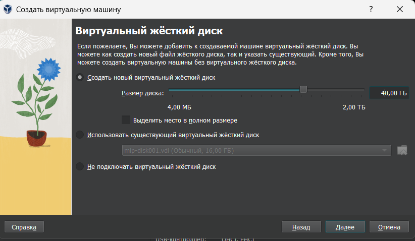
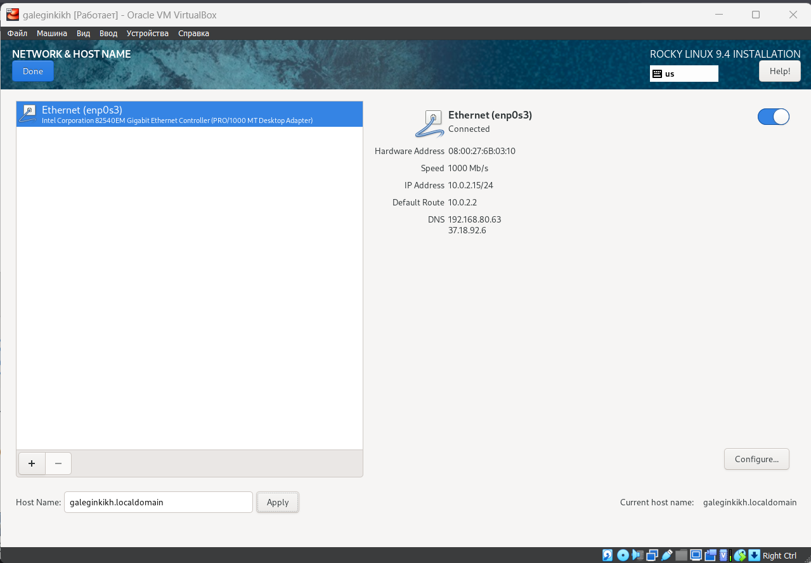
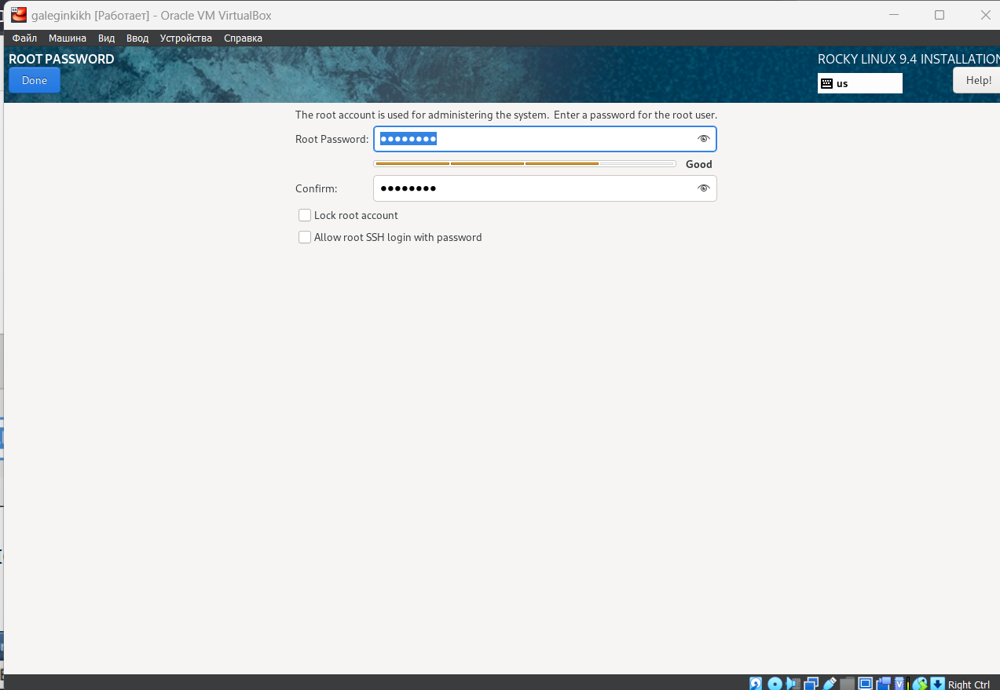
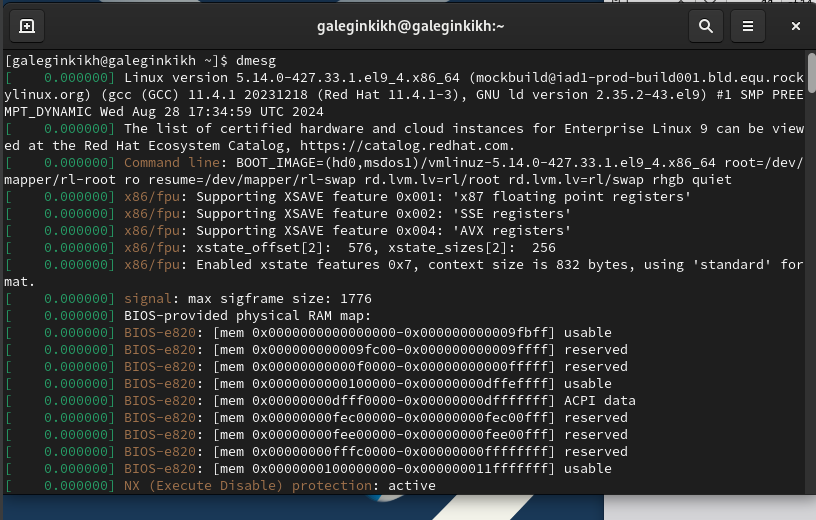
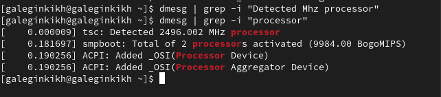
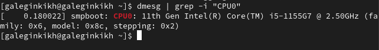
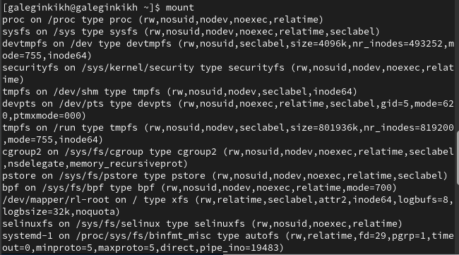

---
## Front matter
lang: ru-RU
title: Лабораторная работа №1
subtitle: Установка и конфигурация операционной системы на виртуальную машину
author:
  - Легиньких Г.А.
institute:
  - Российский университет дружбы народов, Москва, Россия

## i18n babel
babel-lang: russian
babel-otherlangs: english

## Formatting pdf
toc: false
toc-title: Содержание
slide_level: 2
aspectratio: 169
section-titles: true
theme: metropolis
header-includes:
 - \metroset{progressbar=frametitle,sectionpage=progressbar,numbering=fraction}
 - '\makeatletter'
 - '\beamer@ignorenonframefalse'
 - '\makeatother'
---

# Информация

## Докладчик

:::::::::::::: {.columns align=center}
::: {.column width="70%"}

  * Легиньких Галина Андреевна
  * НФИбд-02-21
  * Российский университет дружбы народов
  * [1032216447@pfur.ru](mailto:1032216447@pfur.ru)
  * <https://github.com/galeginkikh>

:::
::: {.column width="30%"}

:::
::::::::::::::

# Выполнение

## Цель работы
Целью данной работы является приобретение практических навыков
установки операционной системы на виртуальную машину, настройки минимально необходимых для дальнейшей работы сервисов.

# Выполнение лабораторной работы

# Настройка виртуальной машины

##

**1.** Для начала я скачала дистрибутив Rocky с официального сайта.

##

**2.**  Далее я приступила к созданию виртуальной машины. Указала имя виртуальной машины, тип Linux, RedHat.

{ #fig:001 width=70% }

##

**3.** Указала размер основной памяти виртуальной машины и процессор.

{ #fig:002 width=70% }

##

**4.** Задайте размер диска — 40 ГБ.

{ #fig:003 width=70% }

##

**5.** Добавила новый привод оптических дисков и выберала образ
операционной системы.

{ #fig:004 width=70% }

##

**6.** Выберала English в качестве языка интерфейса и перешла к настройкам установки операционной
системы.

##

**7.** В разделе выбора программ указала в качестве базового окружения
Server with GUI , а в качестве дополнения — Development Tools.

{ #fig:005 width=70% }

##

**8.** Отключите KDUMP. 

{ #fig:006 width=70% }

##

**9.** Включила сетевое соединение и в качестве имени узла указала
user.localdomain, где вместо user указала имя своего пользователя в соответствии с соглашением об именовании. 

{ #fig:008 width=70% }

##

**10.** Установила пароль для root. 

{ #fig:009 width=70% }

##

**11.** Установила пользователя с правами администратора. 

{ #fig:010 width=70% }

##

**12.** Подключила образ диска дополнений гостевой ОС. 

{ #fig:011 width=70% }

# Домашнее задание

##

**13.** Перешла к домашнему заданию. В окне
терминала проанализировала последовательность загрузки системы, выполнив команду dmesg. 

{ #fig:012 width=70% }

##

**14.** Просмотрела вывод команды dmesg | less. 

{ #fig:013 width=70% }

##

**15.** Получила следующую информацию.
1. Версия ядра Linux (Linux version). 
2. Частота процессора (Detected Mhz processor). 
3. Модель процессора (CPU0). 
4. Объем доступной оперативной памяти (Memory available). 
5. Тип обнаруженного гипервизора (Hypervisor detected). 
6. Тип файловой системы корневого раздела. 
7. Последовательность монтирования файловых систем. 

##

{ #fig:014 width=70% }

##

{ #fig:015 width=70% }

##

{ #fig:016 width=70% }

##

{ #fig:017 width=70% }

##

{ #fig:018 width=70% }

##

{ #fig:019 width=70% }

##

{ #fig:020 width=70% }

# Вывод

Приобрела практические навыки
установки операционной системы на виртуальную машину, настройки минимально необходимых для дальнейшей работы сервисов.