---
## Front matter
title: "Отчет по лабораторной работе №1"
subtitle: "Установка и конфигурация операционной системы на виртуальную машину"
author: "Легиньких Галина Андреевна"

## Generic otions
lang: ru-RU
toc-title: "Содержание"
## Pdf output format
toc: true # Table of contents
toc-depth: 2
lof: true # List of figures
lot: true # List of tables
fontsize: 12pt
linestretch: 1.5
papersize: a4
documentclass: scrreprt
## I18n polyglossia
polyglossia-lang:
  name: russian
  options:
  - spelling=modern
  - babelshorthands=true
polyglossia-otherlangs:
  name: english
## I18n babel
babel-lang: russian
babel-otherlangs: english
## Fonts
mainfont: PT Serif
romanfont: PT Serif
sansfont: PT Sans
monofont: PT Mono
mainfontoptions: Ligatures=TeX
romanfontoptions: Ligatures=TeX
sansfontoptions: Ligatures=TeX,Scale=MatchLowercase
monofontoptions: Scale=MatchLowercase,Scale=0.9
## Biblatex
biblatex: true
biblio-style: "gost-numeric"
biblatexoptions:
  - parentracker=true
  - backend=biber
  - hyperref=auto
  - language=auto
  - autolang=other*
  - citestyle=gost-numeric
## Pandoc-crossref LaTeX customization
figureTitle: "Рис."
tableTitle: "Таблица"
listingTitle: "Листинг"
lofTitle: "Список иллюстраций"
lotTitle: "Список таблиц"
lolTitle: "Листинги"
## Misc options
indent: true
header-includes:
  - \usepackage{indentfirst}
  - \usepackage{float} # keep figures where there are in the text
  - \floatplacement{figure}{H} # keep figures where there are in the text
---

# Цель работы
Целью данной работы является приобретение практических навыков
установки операционной системы на виртуальную машину, настройки минимально необходимых для дальнейшей работы сервисов.

# Теоретическое введение

По ходу лабораторной работы.

# Выполнение лабораторной работы

**1.** Для начала я скачала дистрибутив Rocky с официального сайта.

**2.**  Далее я приступила к созданию виртуальной машины. Указала имя виртуальной машины, тип Linux, RedHat.
(рис. [-@fig:001])

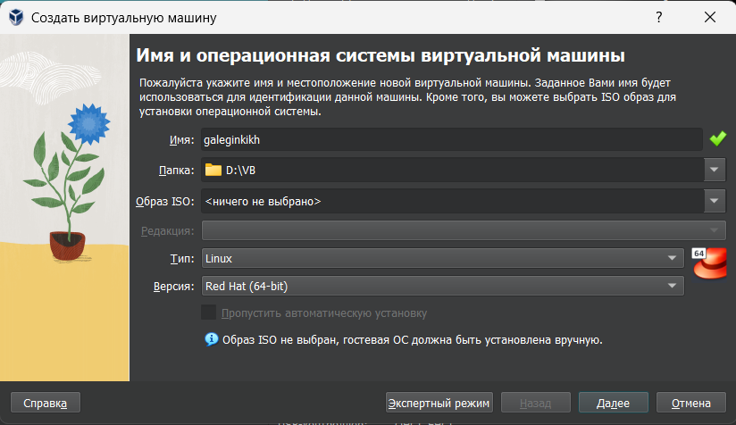{ #fig:001 width=70% }

**3.** Указала размер основной памяти виртуальной машины и процессор.
(рис. [-@fig:002])

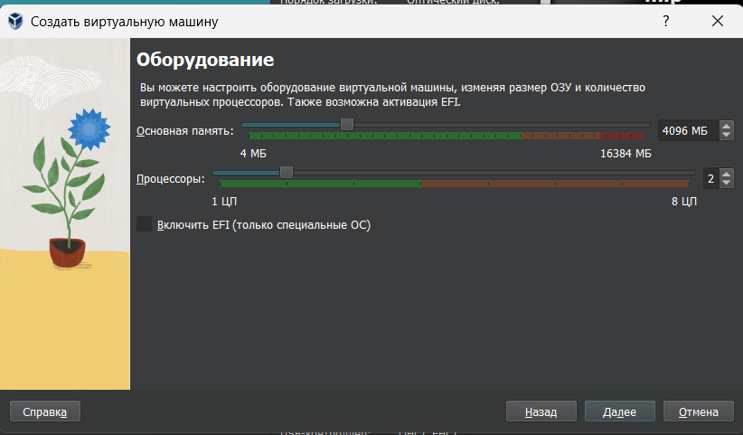{ #fig:002 width=70% }

**4.** Задайте размер диска — 40 ГБ. (рис. [-@fig:003])

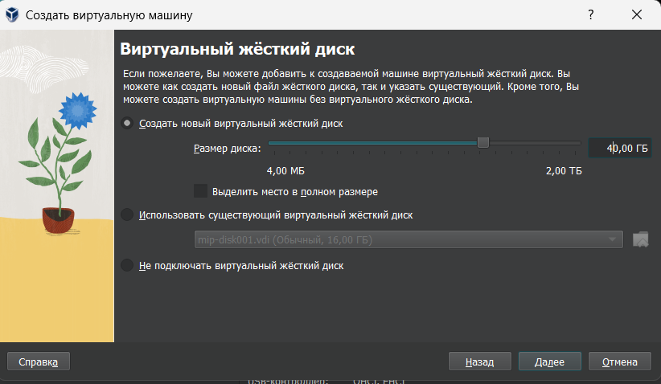{ #fig:003 width=70% }

**5.** Добавила новый привод оптических дисков и выберала образ
операционной системы. (рис. [-@fig:004])

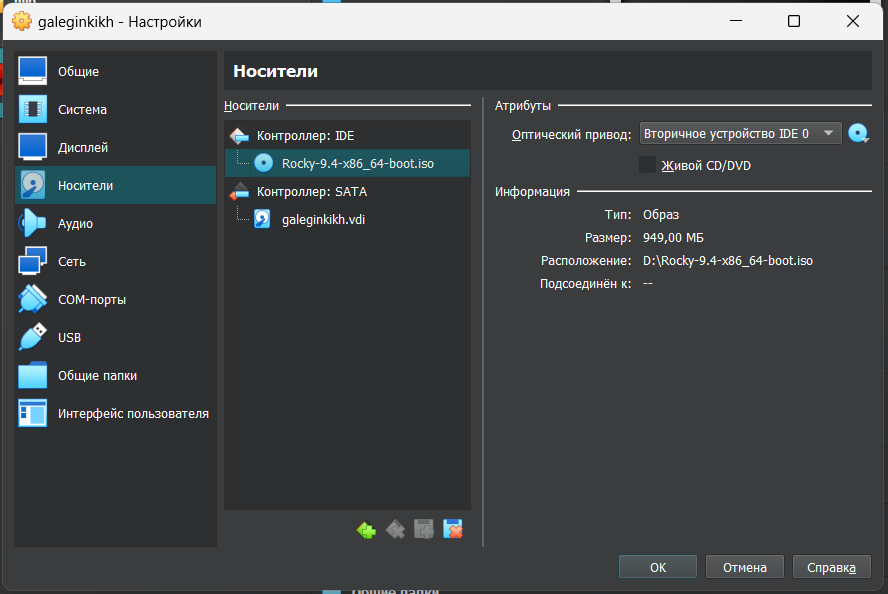{ #fig:004 width=70% }

**6.** Выберала English в качестве языка интерфейса и перешла к настройкам установки операционной
системы.

**7.** В разделе выбора программ указала в качестве базового окружения
Server with GUI , а в качестве дополнения — Development Tools.
(рис. [-@fig:005])

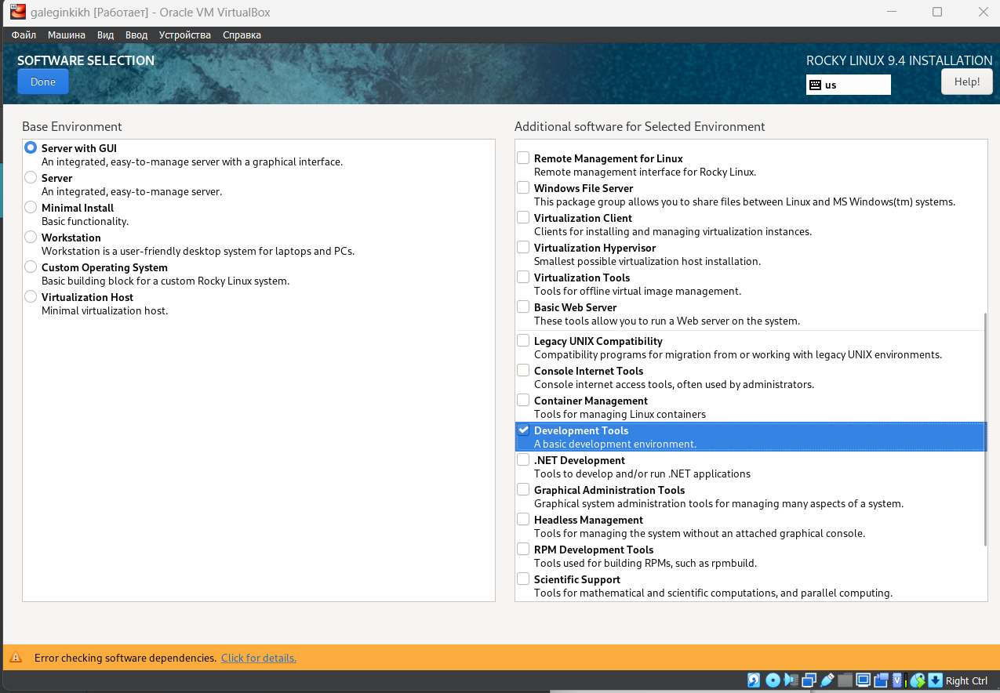{ #fig:005 width=70% }

**8.** Отключите KDUMP. (рис. [-@fig:006])

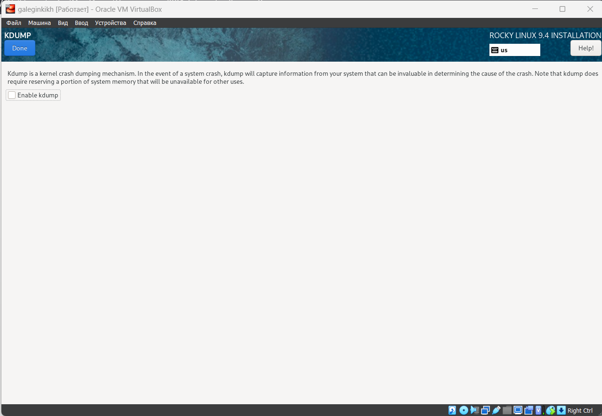{ #fig:006 width=70% }

**9.** Включила сетевое соединение и в качестве имени узла указала
user.localdomain, где вместо user указала имя своего пользователя в соответствии с соглашением об именовании. (рис. [-@fig:008])

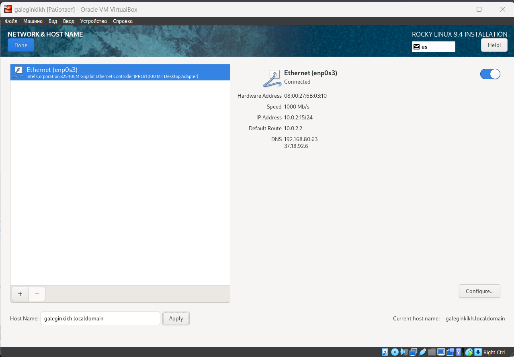{ #fig:008 width=70% }

**10.** Установила пароль для root. (рис. [-@fig:009])

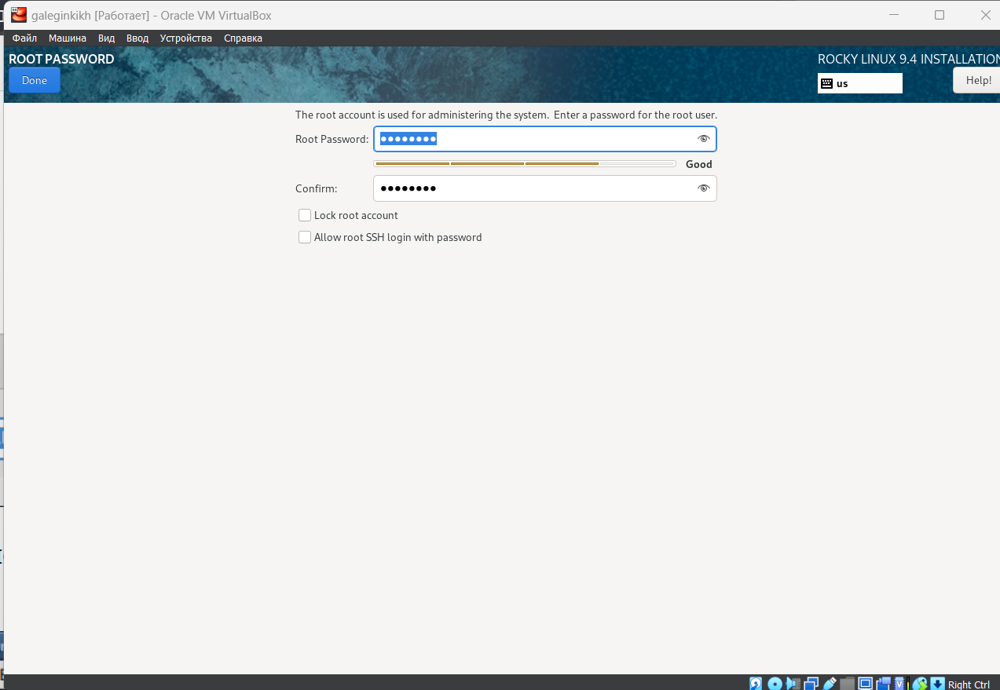{ #fig:009 width=70% }

**11.** Установила пользователя с правами администратора. (рис. [-@fig:010])

{ #fig:010 width=70% }

**12.** Подключила образ диска дополнений гостевой ОС. (рис. [-@fig:011])

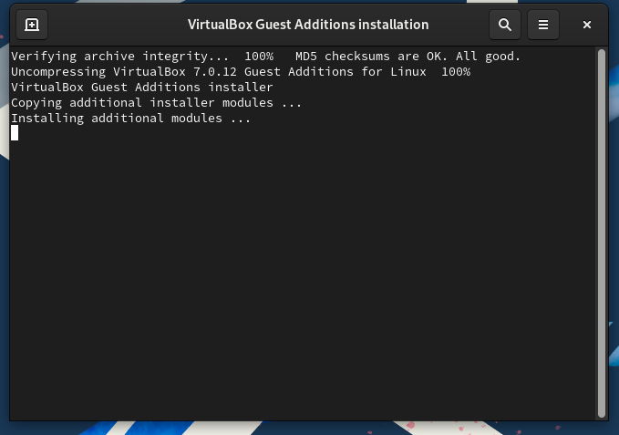{ #fig:011 width=70% }

**13.** Перешла к домашнему заданию. В окне
терминала проанализировала последовательность загрузки системы, выполнив команду dmesg. (рис. [-@fig:012])

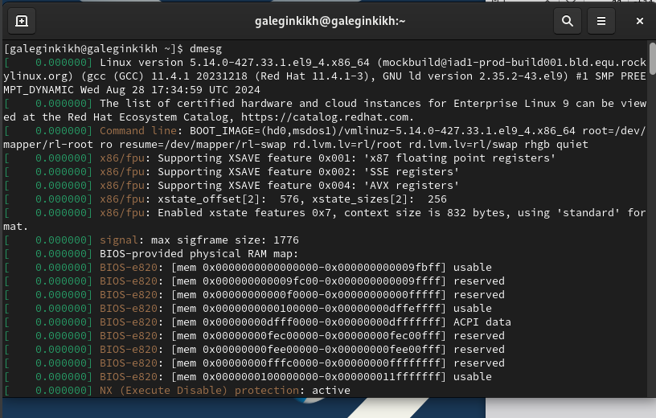{ #fig:012 width=70% }

**14.** Просмотрела вывод команды dmesg | less. 
(рис. [-@fig:013])

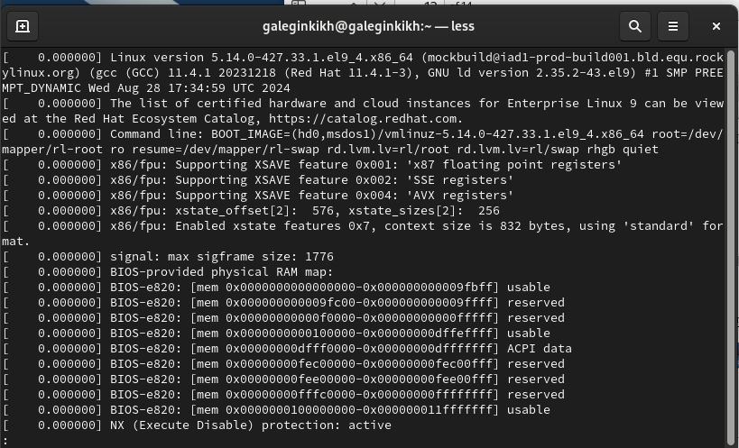{ #fig:013 width=70% }

**15.** Получила следующую информацию.
1. Версия ядра Linux (Linux version). (рис. [-@fig:014])
2. Частота процессора (Detected Mhz processor). (рис. [-@fig:015])
3. Модель процессора (CPU0). (рис. [-@fig:016])
4. Объем доступной оперативной памяти (Memory available). (рис. [-@fig:017])
5. Тип обнаруженного гипервизора (Hypervisor detected). (рис. [-@fig:018])
6. Тип файловой системы корневого раздела. (рис. [-@fig:019])
7. Последовательность монтирования файловых систем. (рис. [-@fig:020])


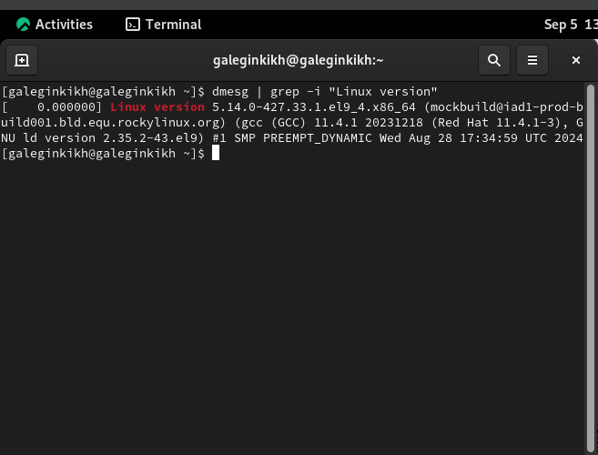{ #fig:014 width=70% }

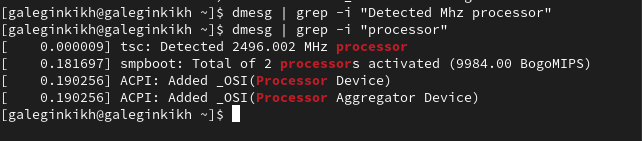{ #fig:015 width=70% }

{ #fig:016 width=70% }

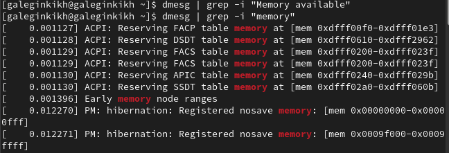{ #fig:017 width=70% }

{ #fig:018 width=70% }

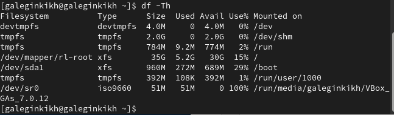{ #fig:019 width=70% }

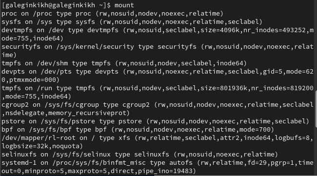{ #fig:020 width=70% }

# Контрольные вопросы

### 1. **Какую информацию содержит учётная запись пользователя?**

Учётная запись пользователя в Linux содержит следующие основные элементы:

- **Имя пользователя**: Уникальный идентификатор для каждого пользователя в системе.
- **Пароль**: Защищённый доступ пользователя.
- **Идентификатор пользователя (UID)**: Числовой идентификатор, уникальный для каждого пользователя.
- **Идентификатор группы (GID)**: Числовой идентификатор основной группы, к которой принадлежит пользователь.
- **Домашний каталог**: Личный каталог пользователя.
- **Оболочка (shell)**: Программа, используемая пользователем для взаимодействия с системой.
- **Информация о пользователе**: Дополнительные сведения, такие как полное имя пользователя или контактные данные.

### 2. **Команды терминала**

#### – для получения справки по команде:
```bash
man <команда>
```
#### – для перемещения по файловой системе:
```bash
cd <путь_к_каталогу>
```
#### – для просмотра содержимого каталога:
```bash
ls
```
#### – для определения объёма каталога:
```bash
du -sh <каталог>
```
#### – для создания / удаления каталогов / файлов:
- **Создание каталога**:
  ```bash
  mkdir <имя_каталога>
  ```
- **Удаление каталога**:
  ```bash
  rmdir <имя_каталога>
  ```
- **Создание файла**:
  ```bash
  touch <имя_файла>
  ```
- **Удаление файла**:
  ```bash
  rm <имя_файла>
  ```
#### – для задания определённых прав на файл / каталог:
```bash
chmod <права> <файл_или_каталог>
```
#### – для просмотра истории команд:
```bash
history
```

### 3. **Что такое файловая система? Примеры и краткая характеристика**

Файловая система — это способ организации, хранения и управления данными на дисках или других устройствах хранения. Она управляет доступом к данным и их расположением на диске.

**Примеры файловых систем:**
- **ext4 (Extended Filesystem 4)**: Стандартная файловая система для большинства дистрибутивов Linux. Поддерживает журналы и большие файлы, высокопроизводительна и стабильна.
- **XFS**: Журналируемая файловая система, разработанная для обработки больших файловых систем и высоких нагрузок. Используется в корпоративных решениях, таких как Red Hat Enterprise Linux.

### 4. **Как посмотреть, какие файловые системы подключены?**

Для просмотра подключённых файловых систем в Linux используется команда:
```bash
df -T
```
Эта команда покажет список подключенных файловых систем и их типы.

# Вывод

Приобрела практические навыки
установки операционной системы на виртуальную машину, настройки минимально необходимых для дальнейшей работы сервисов.