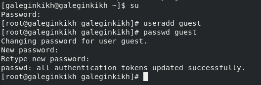
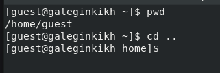
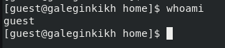
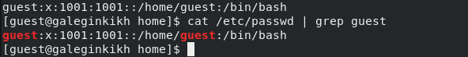
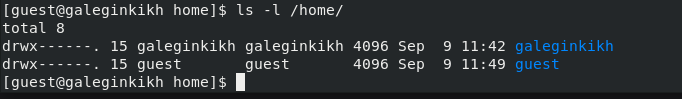

---
## Front matter
lang: ru-RU
title: Лабораторная работа №2
subtitle: Дискреционное разграничение прав в Linux. Основные атрибуты
author:
  - Легиньких Г.А.
institute:
  - Российский университет дружбы народов, Москва, Россия

## i18n babel
babel-lang: russian
babel-otherlangs: english

## Formatting pdf
toc: false
toc-title: Содержание
slide_level: 2
aspectratio: 169
section-titles: true
theme: metropolis
header-includes:
 - \metroset{progressbar=frametitle,sectionpage=progressbar,numbering=fraction}
 - '\makeatletter'
 - '\beamer@ignorenonframefalse'
 - '\makeatother'
---

# Информация

## Докладчик

:::::::::::::: {.columns align=center}
::: {.column width="70%"}

  * Легиньких Галина Андреевна
  * НФИбд-02-21
  * Российский университет дружбы народов
  * [1032216447@pfur.ru](mailto:1032216447@pfur.ru)
  * <https://github.com/galeginkikh>

:::
::: {.column width="30%"}

:::
::::::::::::::

# Выполнение

## Цель работы

Получение практических навыков работы в консоли с атрибутами файлов, закрепление теоретических основ дискреционного разграничения доступа в современных системах с открытым кодом на базе ОС Linux.

## Выполнение лабораторной работы

**1.** Создала учетную запись пользователя guest и задала пароль.

{ #fig:001 width=70% }

##

**2.** Вошла в систему от имени пользователя guest.

{ #fig:002 width=70% }

##

**3.** Определила директорию в которой нахожусь. Это не является домашней дирректорией, поэтому я перешла в домашнюю. 

{ #fig:004 width=70% }

##

**4.** Уточнила имя пользователя командой whoami. 

{ #fig:005 width=70% }

##

**5.** Уточнила имя пользователя, его группу, а также группы, куда входит пользователь, командой id. Сравнила вывод id с выводом команды groups. 

{ #fig:006 width=70% }

##

**6.** Сравнила полученную информацию об имени пользователя с данными,
выводимыми в приглашении командной строки. 

{ #fig:007 width=70% }

##

**7.** Посмотрела файл passwd. 

{ #fig:008 width=70% }

##

**8.** Нашла свою учеьную запись. Определила uid пользователя.
Определила gid пользователя.

{ #fig:009 width=70% }

##

**9.** Определила существующие в системе директории командой
ls -l /home/. Права есть только у пользователя (все). 

{ #fig:010 width=70% }

##

**10.** Проверила какие расширенные атрибуты установлены на поддиректориях, находящихся в директории /home, командой: lsattr /home. Подиректорий нет. 

{ #fig:011 width=70% }

##

**11.** Создала в домашней директории поддиректорию dir1. Проверила, какие права доступа есть у этой дирректории. Для пользователя и групп все разрешено, для других запрещено изменение. 

{ #fig:012 width=70% } 

##

**12.** Сняла с директории dir1 все атрибуты. 

{ #fig:013 width=70% } 

##

**13.** Попыталась создать файл в этой поддиректории, но не получилось, так как нет прав на изменения. 

{ #fig:014 width=70% } 

##

**14.** Заполнила таблицу «Установленные права и разрешённые действия».

##

**15.** На основании заполненной таблицы определила те или иные минимально необходимые права для выполнения операций внутри директории dir1.

| | | | | |
|-|-|-|-|-|
|Операция| |Минимальные  права на  директорию| |Минимальные  права на файл|
|Создание файла| |d(300)| |(000)|
|Удаление файла| |d(300)| |(000)|
|Чтение файла| |d(100)| |(400)|
|Запись в файл| |d(100)| |(200)|
|Переименование файла| |d(300)| |(000)|
|Создание поддиректории| |d(300)| |(000)|
|Удаление поддиректории| |d(300)| |(000)|

# Вывод 

Получила практические навыки работы в консоли с атрибутами файлов, закрепила теоретические основы дискреционного разграничения доступа в современных системах с открытым кодом на базе ОС Linux.