---
## Front matter
title: "Отчет по лабораторной работе №2"
subtitle: "Дискреционное разграничение прав в Linux. Основные атрибуты"
author: "Легиньких Галина Андреевна"

## Generic otions
lang: ru-RU
toc-title: "Содержание"
## Pdf output format
toc: true # Table of contents
toc-depth: 2
lof: true # List of figures
lot: true # List of tables
fontsize: 12pt
linestretch: 1.5
papersize: a4
documentclass: scrreprt
## I18n polyglossia
polyglossia-lang:
  name: russian
  options:
  - spelling=modern
  - babelshorthands=true
polyglossia-otherlangs:
  name: english
## I18n babel
babel-lang: russian
babel-otherlangs: english
## Fonts
mainfont: PT Serif
romanfont: PT Serif
sansfont: PT Sans
monofont: PT Mono
mainfontoptions: Ligatures=TeX
romanfontoptions: Ligatures=TeX
sansfontoptions: Ligatures=TeX,Scale=MatchLowercase
monofontoptions: Scale=MatchLowercase,Scale=0.9
## Biblatex
biblatex: true
biblio-style: "gost-numeric"
biblatexoptions:
  - parentracker=true
  - backend=biber
  - hyperref=auto
  - language=auto
  - autolang=other*
  - citestyle=gost-numeric
## Pandoc-crossref LaTeX customization
figureTitle: "Рис."
tableTitle: "Таблица"
listingTitle: "Листинг"
lofTitle: "Список иллюстраций"
lotTitle: "Список таблиц"
lolTitle: "Листинги"
## Misc options
indent: true
header-includes:
  - \usepackage{indentfirst}
  - \usepackage{float} # keep figures where there are in the text
  - \floatplacement{figure}{H} # keep figures where there are in the text
---

# Цель работы

Получение практических навыков работы в консоли с атрибутами файлов, закрепление теоретических основ дискреционного разграничения доступа в современных системах с открытым кодом на базе ОС Linux.

# Выполнение лабораторной работы

**1.** Создала учетную запись пользователя guest и задала пароль. (рис. [-@fig:001])

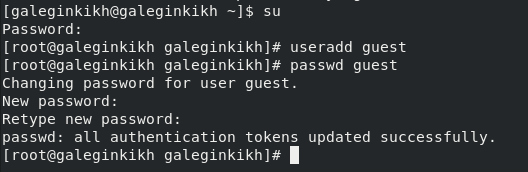{ #fig:001 width=70% }

**2.** Вошла в систему от имени пользователя guest. (рис.[-@fig:002])

{ #fig:002 width=70% }

**3.** Определила директорию в которой нахожусь. Это не является домашней дирректорией, поэтому я перешла в домашнюю. (рис.[-@fig:004])

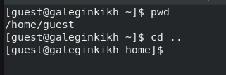{ #fig:004 width=70% }

**4.** Уточнила имя пользователя командой whoami. (рис.[-@fig:005])

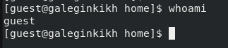{ #fig:005 width=70% }

**5.** Уточнила имя пользователя, его группу, а также группы, куда входит пользователь, командой id. Сравнила вывод id с выводом команды groups. (рис.[-@fig:006])

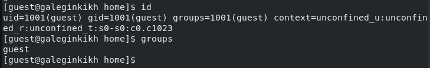{ #fig:006 width=70% }

**6.** Сравнила полученную информацию об имени пользователя с данными,
выводимыми в приглашении командной строки. (рис.[-@fig:007])

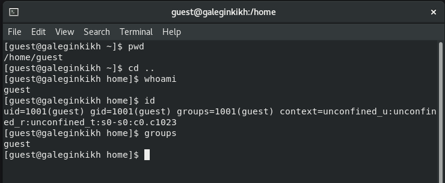{ #fig:007 width=70% }

**7.** Посмотрела файл passwd. (рис.[-@fig:008])

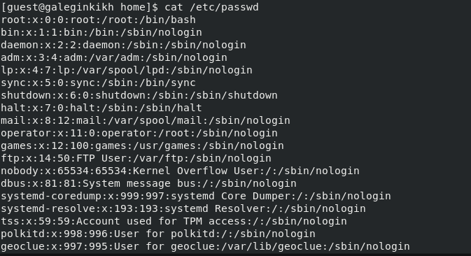{ #fig:008 width=70% }

**8.** Нашла свою учеьную запись. Определила uid пользователя.
Определила gid пользователя. (рис.[-@fig:009])

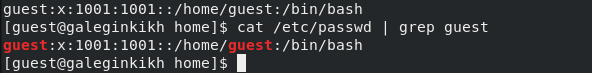{ #fig:009 width=70% }

**9.** Определила существующие в системе директории командой
ls -l /home/. Права есть только у пользователя (все). (рис.[-@fig:010])

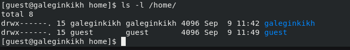{ #fig:010 width=70% }

**10.** Проверила какие расширенные атрибуты установлены на поддиректориях, находящихся в директории /home, командой: lsattr /home. Подиректорий нет. (рис.[-@fig:011])

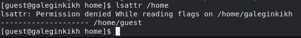{ #fig:011 width=70% }

**11.** Создала в домашней директории поддиректорию dir1. Проверила, какие права доступа есть у этой дирректории. Для пользователя и групп все разрешено, для других запрещено изменение. (рис.[-@fig:012])

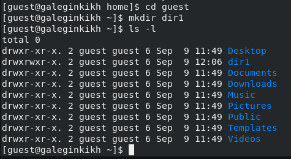{ #fig:012 width=70% } 

**12.** Сняла с директории dir1 все атрибуты. (рис.[-@fig:013])

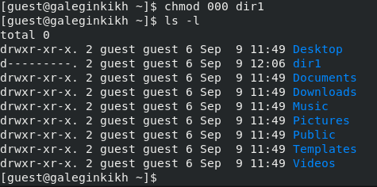{ #fig:013 width=70% } 

**13.** Попыталась создать файл в этой поддиректории, но не получилось, так как нет прав на изменения. (рис.[-@fig:014])

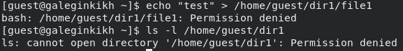{ #fig:014 width=70% } 

**14.** Заполнила таблицу «Установленные права и разрешённые действия».

| | | | | | | | | | |
|-|-|-|-|-|-|-|-|-|-|
|Права директории|Права  файла|Создание  файла|Удаление  файла|Запись  в файл|Чтение  файла|Смена  директории|Просмотр файлов в  директории|Переимено- вание файла|Смена  атрибутов  файла|
|d(000)|(000)| -| -| -| -| -| -| -| -|
|d(000)|(100)| -| -| -| -| -| -| -| -|
|d(000)|(200)| -| -| -| -| -| -| -| -|
|d(000)|(300)| -| -| -| -| -| -| -| -|
|d(000)|(400)| -| -| -| -| -| -| -| -|
|d(000)|(500)| -| -| -| -| -| -| -| -|
|d(000)|(600)| -| -| -| -| -| -| -| -|
|d(000)|(700)| -| -| -| -| -| -| -| -|
|d(100)|(000)| -| -| -| -|+| -| -|+|
|d(100)|(100)| -| -| -| -|+| -| -|+|
|d(100)|(200)| -| -|+| -|+| -| -|+|
|d(100)|(300)| -| -|+| -|+| -| -|+|
|d(100)|(400)| -| -|-|+|+| -| -|+|
|d(100)|(500)| -| -|-|+|+| -| -|+|
|d(100)|(600)| -| -|+|+|+| -| -|+|
|d(100)|(700)| -| -|+|+|+| -| -|+|
|d(200)|(000)| -| -|-|-|-| -| -|-|
|d(200)|(100)| -| -|-|-|-| -| -|-|
|d(200)|(200)| -| -|-|-|-| -| -|-|
|d(200)|(300)| -| -|-|-|-| -| -|-|
|d(200)|(400)| -| -|-|-|-| -| -|-|
|d(200)|(500)| -| -|-|-|-| -| -|-|
|d(200)|(600)| -| -|-|-|-| -| -|-|
|d(200)|(700)| -| -|-|-|-| -| -|-|
|d(300)|(000)|+|+|-|-|+| -|+|+|
|d(300)|(100)|+|+|-|-|+| -|+|+|
|d(300)|(200)|+|+|+|-|+| -|+|+|
|d(300)|(300)|+|+|+|-|+| -|+|+|
|d(300)|(400)|+|+|-|+|+| -|+|+|
|d(300)|(500)|+|+|-|+|+| -|+|+|
|d(300)|(600)|+|+|+|+|+| -|+|+|
|d(300)|(700)|+|+|+|+|+| -|+|+|
|d(400)|(000)|-|-|-|-|-|+|-|-|
|d(400)|(100)|-|-|-|-|-|+|-|-|
|d(400)|(200)|-|-|-|-|-|+|-|-|
|d(400)|(300)|-|-|-|-|-|+|-|-|
|d(400)|(400)|-|-|-|-|-|+|-|-|
|d(400)|(500)|-|-|-|-|-|+|-|-|
|d(400)|(600)|-|-|-|-|-|+|-|-|
|d(400)|(700)|-|-|-|-|-|+|-|-|
|d(500)|(000)|-|-|-|-|+|+|-|+|
|d(500)|(100)|-|-|-|-|+|+|-|+|
|d(500)|(200)|-|-|+|-|+|+|-|+|
|d(500)|(300)|-|-|+|-|+|+|-|+|
|d(500)|(400)|-|-|-|+|+|+|-|+|
|d(500)|(500)|-|-|-|+|+|+|-|+|
|d(500)|(600)|-|-|+|+|+|+|-|+|
|d(500)|(700)|-|-|+|+|+|+|-|+|
|d(600)|(000)|-|-|-|-|-|+|-|-|
|d(600)|(100)|-|-|-|-|-|+|-|-|
|d(600)|(200)|-|-|-|-|-|+|-|-|
|d(600)|(300)|-|-|-|-|-|+|-|-|
|d(600)|(400)|-|-|-|-|-|+|-|-|
|d(600)|(500)|-|-|-|-|-|+|-|-|
|d(600)|(600)|-|-|-|-|-|+|-|-|
|d(600)|(700)|-|-|-|-|-|+|-|-|
|d(700)|(000)|+|+|-|-|+|+|+|+|
|d(700)|(100)|+|+|-|-|+|+|+|+|
|d(700)|(200)|+|+|+|-|+|+|+|+|
|d(700)|(300)|+|+|+|-|+|+|+|+|
|d(700)|(400)|+|+|-|+|+|+|+|+|
|d(700)|(500)|+|+|-|+|+|+|+|+|
|d(700)|(600)|+|+|+|+|+|+|+|+|
|d(700)|(700)|+|+|+|+|+|+|+|+|

**15.** На основании заполненной таблицы определила те или иные минимально необходимые права для выполнения операций внутри директории dir1.

| | | | | |
|-|-|-|-|-|
|Операция| |Минимальные  права на  директорию| |Минимальные  права на файл|
|Создание файла| |d(300)| |(000)|
|Удаление файла| |d(300)| |(000)|
|Чтение файла| |d(100)| |(400)|
|Запись в файл| |d(100)| |(200)|
|Переименование файла| |d(300)| |(000)|
|Создание поддиректории| |d(300)| |(000)|
|Удаление поддиректории| |d(300)| |(000)|

# Вывод 

Получила практические навыки работы в консоли с атрибутами файлов, закрепила теоретические основы дискреционного разграничения доступа в современных системах с открытым кодом на базе ОС Linux.