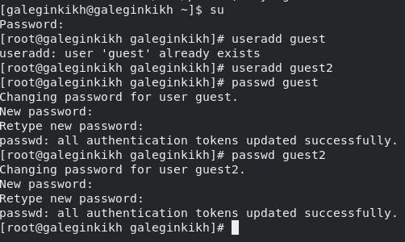
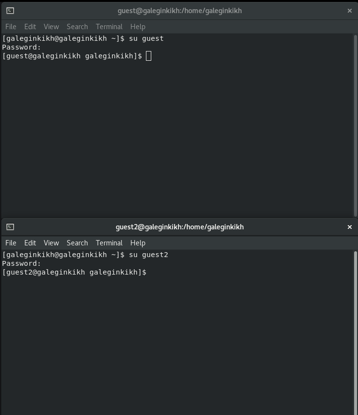
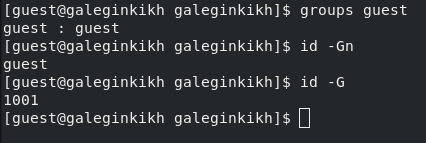

---
## Front matter
lang: ru-RU
title: Лабораторная работа №3
subtitle: Дискреционное разграничение прав в Linux. Два пользователя
author:
  - Легиньких Г.А.
institute:
  - Российский университет дружбы народов, Москва, Россия

## i18n babel
babel-lang: russian
babel-otherlangs: english

## Formatting pdf
toc: false
toc-title: Содержание
slide_level: 2
aspectratio: 169
section-titles: true
theme: metropolis
header-includes:
 - \metroset{progressbar=frametitle,sectionpage=progressbar,numbering=fraction}
 - '\makeatletter'
 - '\beamer@ignorenonframefalse'
 - '\makeatother'
---

# Информация

## Докладчик

:::::::::::::: {.columns align=center}
::: {.column width="70%"}

  * Легиньких Галина Андреевна
  * НФИбд-02-21
  * Российский университет дружбы народов
  * [1032216447@pfur.ru](mailto:1032216447@pfur.ru)
  * <https://github.com/galeginkikh>

:::
::: {.column width="30%"}

:::
::::::::::::::

# Выполнение

## Цель работы

Получение практических навыков работы в консоли с атрибутами файлов для групп пользователей.

# Выполнение лабораторной работы

**1.** Создала учетную запись пользователя guest2 и задала пароль. 

{ #fig:001 width=70% }

##

**2.** Добавьте пользователя guest2 в группу guest. 

{ #fig:002 width=70% }

##

**3.** Осуществила вход в систему от двух пользователей на двух разных консолях: guest на первой консоли и guest2 на второй консоли. 

{ #fig:003 width=70% }

##

**4.** Для обоих пользователей командой pwd определила директорию, в которой нахожусь. Сравнила её с приглашениями командной строки. 

{ #fig:004 width=70% }

{ #fig:005 width=70% }

##

**5.** Уточнила имя пользователя, его группу, кто входит в неё
и к каким группам принадлежит он сам. Определила командами
groups guest и groups guest2, в какие группы входят пользователи guest и guest2. Сравнила вывод команды groups с выводом команд
id -Gn и id -G. 

{ #fig:006 width=70% }

{ #fig:007 width=70% }

##

**6.** Сравнила полученную информацию с содержимым файла /etc/group. 

{ #fig:008 width=70% }

##

**7.** От имени пользователя guest2 выполнила регистрацию пользователя
guest2 в группе guest. 

{ #fig:010 width=70% }

##

**8.** От имени пользователя guest изменила права директории /home/guest,
разрешив все действия для пользователей группы. Сняла с директории /home/guest/dir1
все атрибуты командой. 

{ #fig:011 width=70% }

##

**9.** Меняя атрибуты у директории dir1 и файла file1 от имени пользователя guest и делая проверку от пользователя guest2, заполнила таблицу,
определив опытным путём, какие операции разрешены, а какие нет.

##

**10.** На основании заполненной таблицы определила те или иные минимально необходимые права для выполнения пользователем guest2 операций
внутри директории dir1 и заполнила таблицу.

##

|        Операция        | Права на директорию | Права на файл |
|------------------------|---------------------------------|---------------------------|
|     Создание файла     |           ```(030)```      |      ```(000)```     |	    
|     Удаление файла     |           ```(030)```      |      ```(000)```     |
|      Чтение файла      |           ```(010)```      |      ```(040)```     |
|      Запись в файл     |           ```(010)```      |      ```(020)```     |
|  Переименование файла  |           ```(030)```      |      ```(000)```     |
| Создание поддиректории |           ```(030)```      |      ```(000)```     |
| Удаление поддиректории |           ```(030)```      |      ```(000)```     |

# Вывод

Получила практические навыки работы в консоли с атрибутами файлов для групп пользователей.