---
## Front matter
lang: ru-RU
title: Лабораторная работа №5
subtitle: Дискреционное разграничение прав в Linux. Исследование влияния дополнительных атрибутов.
author:
  - Легиньких Г.А.
institute:
  - Российский университет дружбы народов, Москва, Россия

## i18n babel
babel-lang: russian
babel-otherlangs: english

## Formatting pdf
toc: false
toc-title: Содержание
slide_level: 2
aspectratio: 169
section-titles: true
theme: metropolis
header-includes:
 - \metroset{progressbar=frametitle,sectionpage=progressbar,numbering=fraction}
 - '\makeatletter'
 - '\beamer@ignorenonframefalse'
 - '\makeatother'
---

# Информация

## Докладчик

:::::::::::::: {.columns align=center}
::: {.column width="70%"}

  * Легиньких Галина Андреевна
  * НФИбд-02-21
  * Российский университет дружбы народов
  * [1032216447@pfur.ru](mailto:1032216447@pfur.ru)
  * <https://github.com/galeginkikh>

:::
::: {.column width="30%"}

:::
::::::::::::::

# Выполнение

## Цель работы

Изучение механизмов изменения идентификаторов, применения SetUID- и Sticky-битов. Получение практических навыков работы в консоли с дополнительными атрибутами. Рассмотрение работы механизма смены идентификатора процессов пользователей, а также влияние бита Sticky на запись и удаление файлов.

## Выполнение лабораторной работы

**1.** Установила компилятор gcc. Отключила систему защиты до очередной перезагрузки системы. 

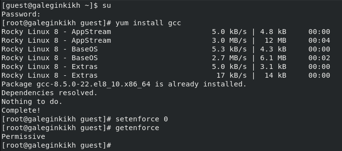{ #fig:001 width=70% }

## Выполнение лабораторной работы

**2.** Вошла в систему от имени пользователя guest.

**3.** Создала программу simpleid.c. 

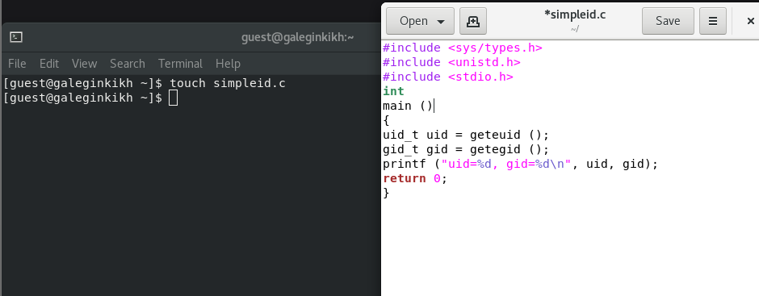{ #fig:002 width=70% }

## Выполнение лабораторной работы

**4.** Скомплилировала программу и убедилась, что файл программы создан. 

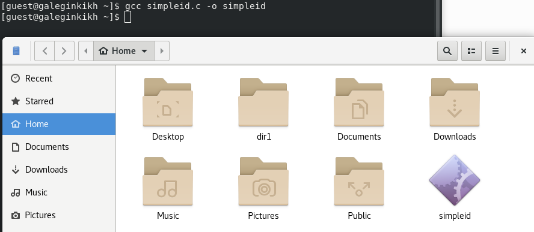{ #fig:003 width=70% }

## Выполнение лабораторной работы

**5.** Выполнила программу simpleid. Выполнила системную программу id. Сравнила полученные результаты. Они схожи. 

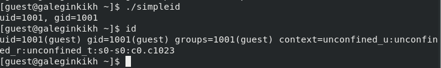{ #fig:004 width=70% }

## Выполнение лабораторной работы

**6.** Усложнила программу,добавив вывод действительных идентификаторов. Получившуюся программу назовала simpleid2.c.
Скомпилировала и запустила simpleid2.c. 

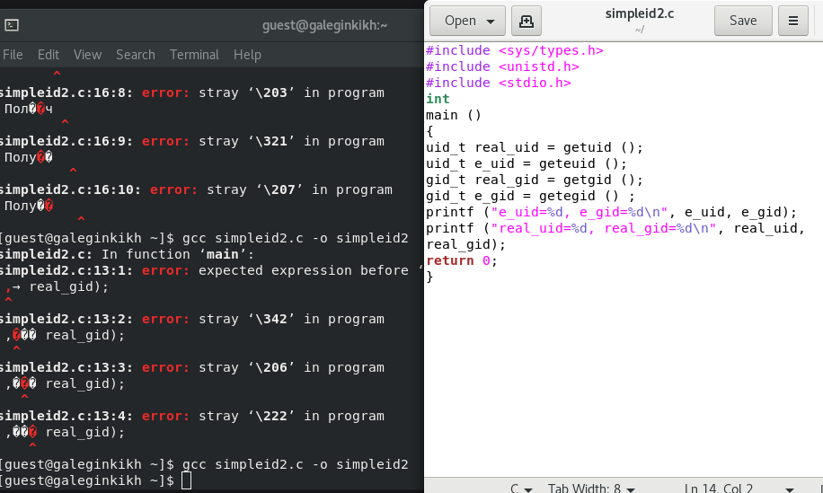{ #fig:005 width=70% }

## Выполнение лабораторной работы

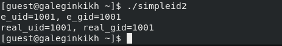{ #fig:006 width=70% }

## Выполнение лабораторной работы

**7.** От имени суперпользователя выполнила команды. 

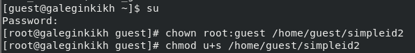{ #fig:007 width=70% }

## Выполнение лабораторной работы

**8.** Выполнила проверку правильности установки новых атрибутов и смены
владельца файла simpleid2.Запустила simpleid2 и id. Сравнила результаты.  

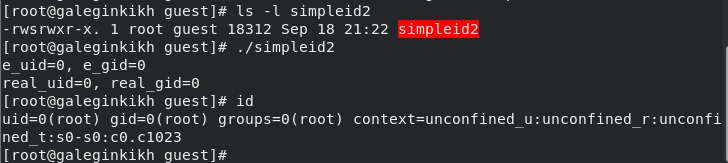{ #fig:008 width=70% }

## Выполнение лабораторной работы

**9.**  Проделала тоже самое относительно SetGID-бита. 

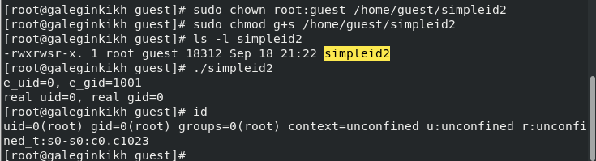{ #fig:009 width=70% }

## Выполнение лабораторной работы

**10.** Создала программу readfile.c. Откомпелировала ее. 

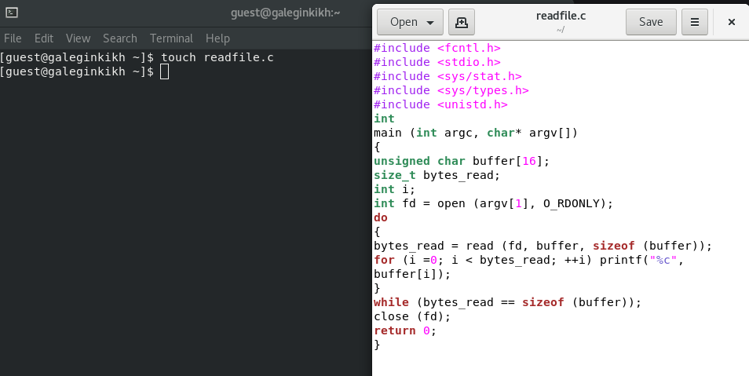{ #fig:010 width=70% }

## Выполнение лабораторной работы

**11.** . Сменила владельца у файла readfile.c и изменила права так, чтобы только суперпользователь (root) мог прочитать его, a guest не мог. Проверила, что пользователь guest не может прочитать файл readfile.c.
Сменила у программы readfile владельца и установила SetU’D-бит. 

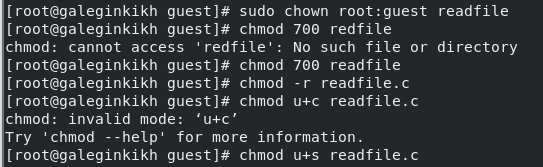{ #fig:011 width=70% }

## Выполнение лабораторной работы

**12.** Проверила, может ли программа readfile прочитать файл readfile.c. Проверила, может ли программа readfile прочитать файл /etc/shadow. 

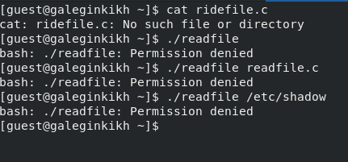{ #fig:012 width=70% }

## Выполнение лабораторной работы

**13.** От имени суперпользователя все выполняется. 

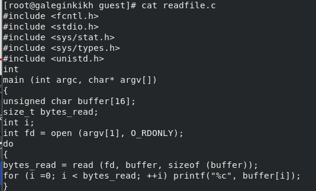{ #fig:013 width=70% }

## Выполнение лабораторной работы

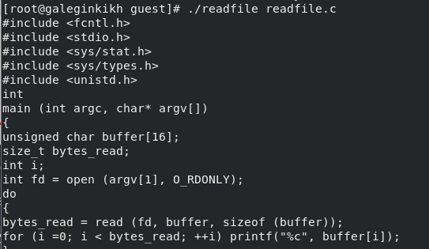{ #fig:014 width=70% }

## Выполнение лабораторной работы

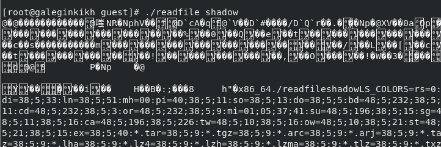{ #fig:015 width=70% }

## Выполнение лабораторной работы

**14.** Выяснила, установлен ли атрибут Sticky на директории /tmp. От имени пользователя guest создала файл file01.txt в директории /tmp со словом test. Просмотрела атрибуты у только что созданного файла и разрешила чтение и запись для категории пользователей "Все остальные".

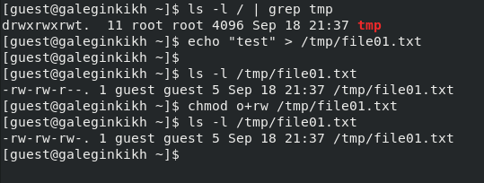{ #fig:016 width=70% }

## Выполнение лабораторной работы

**15.** От пользователя guest2 попробовала дозаписать в файл
/tmp/file01.txt слово test2. Проверила содержимое файла.

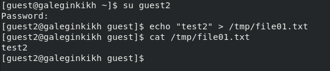{ #fig:017 width=70% }

## Выполнение лабораторной работы

**16.** От пользователя guest2 попробовала дозаписать в файл
/tmp/file01.txt слово test3. Проверила содержимое файла. А вот удалить файл не удалось. 

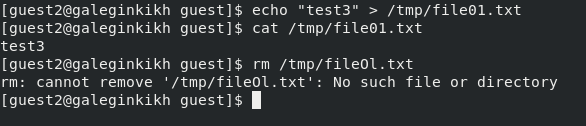{ #fig:018 width=70% }

## Выполнение лабораторной работы

**17.** Повысила прова до суперпользователя. Сняла аотрибут t. Покинула режим суперпользователя. Проверила отсутвтвие атрибута t. Повторила предыдущие шаги.

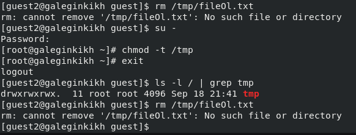{ #fig:019 width=70% }

## Выполнение лабораторной работы

**18.** Вернула атрибут t. 

{ #fig:020 width=70% }

# Вывод

Изучила механизмы изменения идентификаторов, применения SetUID- и Sticky-битов. Получила практические навыки работы в консоли с дополнительными атрибутами. Рассмотрела работы механизма смены идентификатора процессов пользователей, а также влияние бита Sticky на запись и удаление файлов.

