---
## Front matter
title: "Отчет по лабораторной работе №5"
subtitle: "Дискреционное разграничение прав в Linux. Исследование влияния дополнительных атрибутов"
author: "Легиньких Галина Андреевна"

## Generic otions
lang: ru-RU
toc-title: "Содержание"
## Pdf output format
toc: true # Table of contents
toc-depth: 2
lof: true # List of figures
lot: true # List of tables
fontsize: 12pt
linestretch: 1.5
papersize: a4
documentclass: scrreprt
## I18n polyglossia
polyglossia-lang:
  name: russian
  options:
  - spelling=modern
  - babelshorthands=true
polyglossia-otherlangs:
  name: english
## I18n babel
babel-lang: russian
babel-otherlangs: english
## Fonts
mainfont: PT Serif
romanfont: PT Serif
sansfont: PT Sans
monofont: PT Mono
mainfontoptions: Ligatures=TeX
romanfontoptions: Ligatures=TeX
sansfontoptions: Ligatures=TeX,Scale=MatchLowercase
monofontoptions: Scale=MatchLowercase,Scale=0.9
## Biblatex
biblatex: true
biblio-style: "gost-numeric"
biblatexoptions:
  - parentracker=true
  - backend=biber
  - hyperref=auto
  - language=auto
  - autolang=other*
  - citestyle=gost-numeric
## Pandoc-crossref LaTeX customization
figureTitle: "Рис."
tableTitle: "Таблица"
listingTitle: "Листинг"
lofTitle: "Список иллюстраций"
lotTitle: "Список таблиц"
lolTitle: "Листинги"
## Misc options
indent: true
header-includes:
  - \usepackage{indentfirst}
  - \usepackage{float} # keep figures where there are in the text
  - \floatplacement{figure}{H} # keep figures where there are in the text
---

# Цель работы

Изучение механизмов изменения идентификаторов, применения SetUID- и Sticky-битов. Получение практических навыков работы в консоли с дополнительными атрибутами. Рассмотрение работы механизма смены идентификатора процессов пользователей, а также влияние бита Sticky на запись и удаление файлов.

# Выполнение лабораторной работы

**1.** Установила компилятор gcc. Отключила систему защиты до очередной перезагрузки системы. (рис. [-@fig:001])

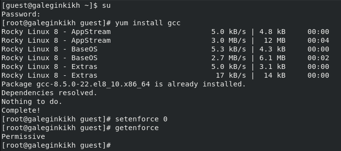{ #fig:001 width=70% }

**2.** Вошла в систему от имени пользователя guest.

**3.** Создала программу simpleid.c. (рис. [-@fig:002])

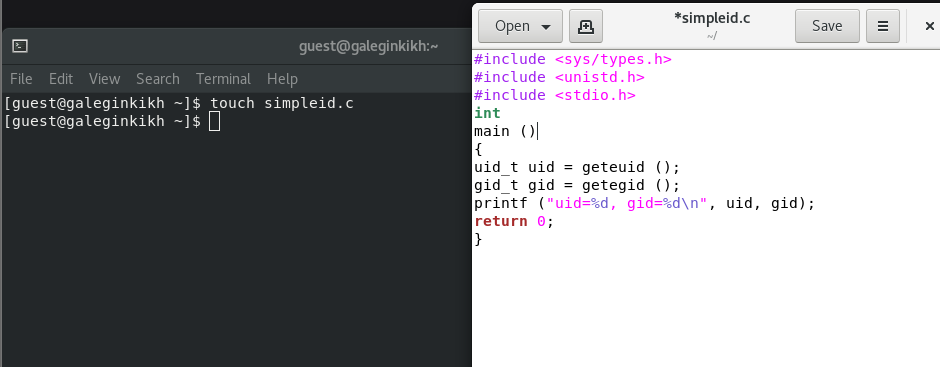{ #fig:002 width=70% }

**4.** Скомплилировала программу и убедилась, что файл программы создан. (рис. [-@fig:003])

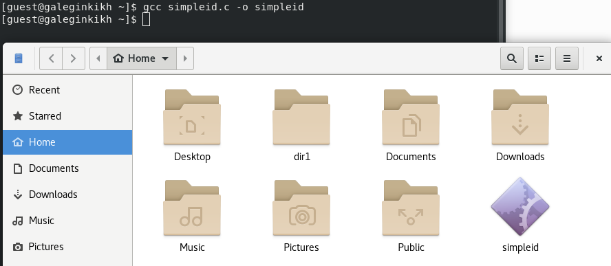{ #fig:003 width=70% }

**5.** Выполнила программу simpleid. Выполнила системную программу id. Сравнила полученные результаты. Они схожи. (рис. [-@fig:004])

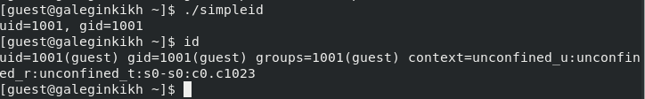{ #fig:004 width=70% }

**6.** Усложнила программу,добавив вывод действительных идентификаторов. Получившуюся программу назовала simpleid2.c.
Скомпилировала и запустила simpleid2.c. (рис. [-@fig:005]) (рис. [-@fig:006])

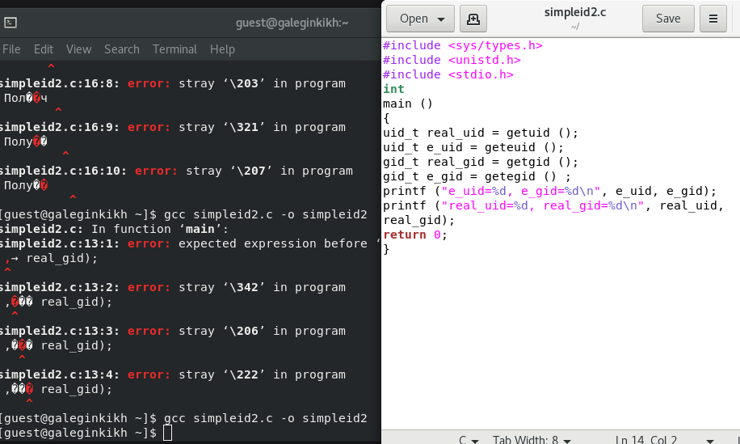{ #fig:005 width=70% }

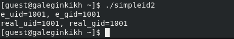{ #fig:006 width=70% }

**7.** От имени суперпользователя выполнила команды. (рис. [-@fig:007])

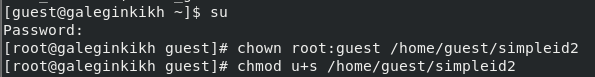{ #fig:007 width=70% }

**8.** Выполнила проверку правильности установки новых атрибутов и смены
владельца файла simpleid2.Запустила simpleid2 и id. Сравнила результаты.  (рис. [-@fig:008])

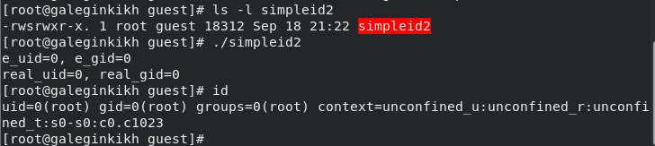{ #fig:008 width=70% }

**9.**  Проделала тоже самое относительно SetGID-бита. (рис. [-@fig:009])

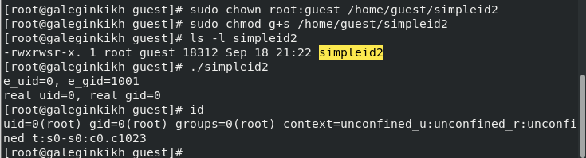{ #fig:009 width=70% }

**10.** Создала программу readfile.c. Откомпелировала ее. (рис. [-@fig:010])

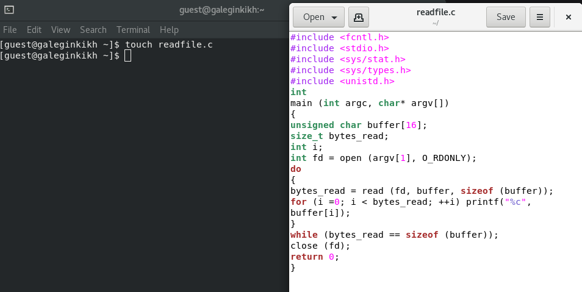{ #fig:010 width=70% }

**11.** . Сменила владельца у файла readfile.c и изменила права так, чтобы только суперпользователь (root) мог прочитать его, a guest не мог. Проверила, что пользователь guest не может прочитать файл readfile.c.
Сменила у программы readfile владельца и установила SetU’D-бит. (рис. [-@fig:011])

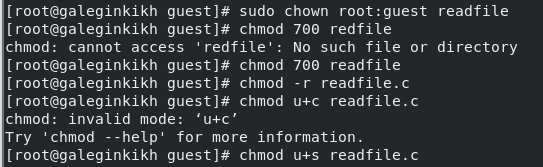{ #fig:011 width=70% }

**12.** Проверила, может ли программа readfile прочитать файл readfile.c. Проверила, может ли программа readfile прочитать файл /etc/shadow. (рис. [-@fig:012])

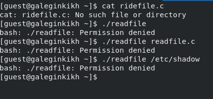{ #fig:012 width=70% }

**13.** От имени суперпользователя все выполняется. (рис. [-@fig:013]) (рис. [-@fig:014]) (рис. [-@fig:015])

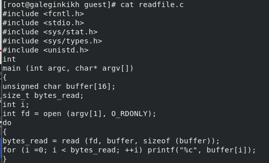{ #fig:013 width=70% }

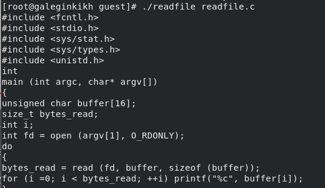{ #fig:014 width=70% }

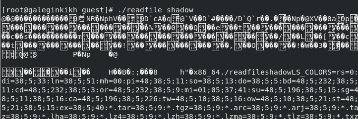{ #fig:015 width=70% }

**14.** Выяснила, установлен ли атрибут Sticky на директории /tmp. От имени пользователя guest создала файл file01.txt в директории /tmp со словом test. Просмотрела атрибуты у только что созданного файла и разрешила чтение и запись для категории пользователей "Все остальные". (рис. [-@fig:016])

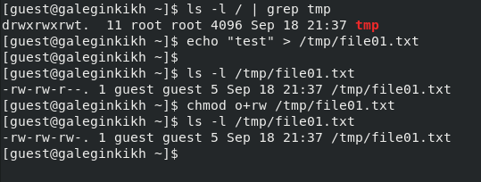{ #fig:016 width=70% }

**15.** От пользователя guest2 попробовала дозаписать в файл
/tmp/file01.txt слово test2. Проверила содержимое файла. (рис. [-@fig:017])

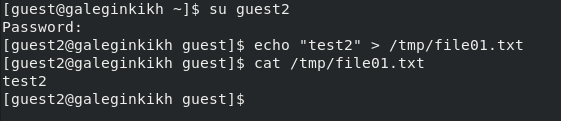{ #fig:017 width=70% }

**16.** От пользователя guest2 попробовала дозаписать в файл
/tmp/file01.txt слово test3. Проверила содержимое файла. А вот удалить файл не удалось. (рис. [-@fig:018])

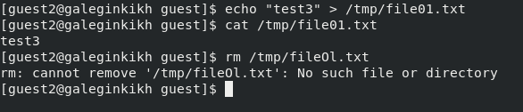{ #fig:018 width=70% }

**17.** Повысила прова до суперпользователя. Сняла аотрибут t. Покинула режим суперпользователя. Проверила отсутвтвие атрибута t. Повторила предыдущие шаги. (рис. [-@fig:019])

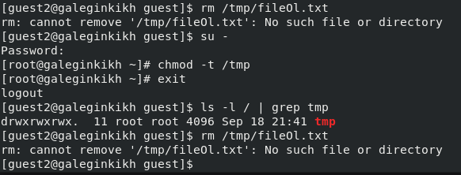{ #fig:019 width=70% }

**18.** Вернула атрибут t. (рис. [-@fig:020])

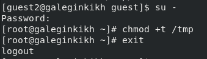{ #fig:020 width=70% }

# Вывод

Изучила механизмы изменения идентификаторов, применения SetUID- и Sticky-битов. Получила практические навыки работы в консоли с дополнительными атрибутами. Рассмотрела работы механизма смены идентификатора процессов пользователей, а также влияние бита Sticky на запись и удаление файлов.

