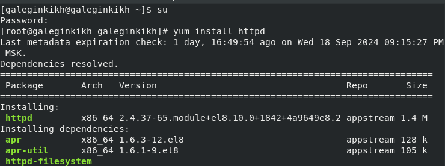
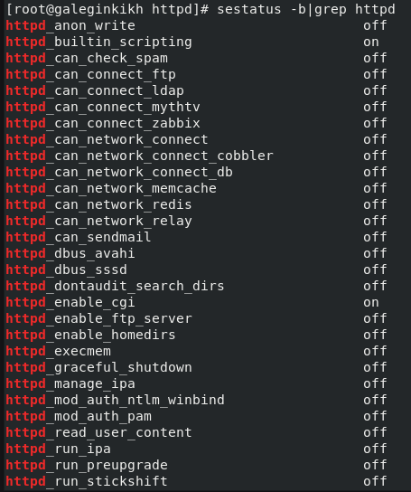
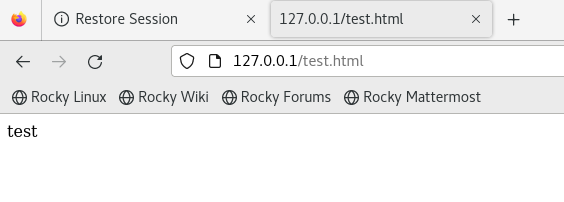
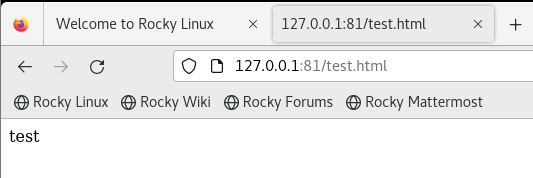

---
## Front matter
lang: ru-RU
title: Лабораторная работа №6
subtitle: Мандатное разграничение прав в Linux
author:
  - Легиньких Г.А.
institute:
  - Российский университет дружбы народов, Москва, Россия

## i18n babel
babel-lang: russian
babel-otherlangs: english

## Formatting pdf
toc: false
toc-title: Содержание
slide_level: 2
aspectratio: 169
section-titles: true
theme: metropolis
header-includes:
 - \metroset{progressbar=frametitle,sectionpage=progressbar,numbering=fraction}
 - '\makeatletter'
 - '\beamer@ignorenonframefalse'
 - '\makeatother'
---

# Информация

## Докладчик

:::::::::::::: {.columns align=center}
::: {.column width="70%"}

  * Легиньких Галина Андреевна
  * НФИбд-02-21
  * Российский университет дружбы народов
  * [1032216447@pfur.ru](mailto:1032216447@pfur.ru)
  * <https://github.com/galeginkikh>

:::
::: {.column width="30%"}

:::
::::::::::::::

# Выполнение

## Цель работы
Развить навыки администрирования ОС Linux. Получить первое практическое знакомство с технологией SELinux. Проверить работу SELinx на практике совместно с веб-сервером Apache.

## Выполнение лабораторной работы

**1.** Скачала httpd. (рис. [-@fig:001])

{ #fig:001 width=70% }

## Выполнение лабораторной работы

**2.** В конфигурационном файле /etc/httpd/httpd.conf задала параметр ServerName. Отключила пакетный фильтр. (рис. [-@fig:002])

{ #fig:002 width=70% }

## Выполнение лабораторной работы

**3.** Вошла в систему с полученными учётными данными и убедилась, что SELinux работает в режиме enforcing политики targeted. (рис. [-@fig:003])

{ #fig:003 width=70% }

## Выполнение лабораторной работы

**4.** Обратитилась с помощью браузера к веб-серверу, запущенному на компьютере, и убедилась, что последний работает. Он не работает, запустила его так же, но с параметром start. (рис. [-@fig:004]) (рис. [-@fig:005])

{ #fig:004 width=70% }

## Выполнение лабораторной работы

{ #fig:005 width=70% }

## Выполнение лабораторной работы

**5.** Нашла веб-сервер Apache в списке процессов, определила его контекст безопасности. (рис. [-@fig:006])

{ #fig:006 width=70% }

## Выполнение лабораторной работы

**6.** Посмотрела текущее состояние переключателей SELinux для Apache. Обратила внимание, что многие из них находятся в положении «off». (рис. [-@fig:007])

{ #fig:007 width=70% } 

## Выполнение лабораторной работы

**7.** Посмотрела статистику по политике с помощью команды seinfo, также определила множество пользователей, ролей, типов. (рис. [-@fig:008])

{ #fig:008 width=70% } 

## Выполнение лабораторной работы

**8.**  Определила тип файлов и поддиректорий, находящихся в директории /var/www. (рис. [-@fig:009])

{ #fig:009 width=70% } 

## Выполнение лабораторной работы

**9.** Определила тип файлов, находящихся в директории /var/www/html. (рис. [-@fig:010])

{ #fig:010 width=70% }

## Выполнение лабораторной работы

**10.** Определила круг пользователей, которым разрешено создание файлов в директории /var/www/html. (рис. [-@fig:011])

{ #fig:011 width=70% }

## Выполнение лабораторной работы

**11.** Создала от имени суперпользователя html-файл /var/www/html/test.html. (рис. [-@fig:012])

{ #fig:012 width=70% }

## Выполнение лабораторной работы

**12.** Проверила контекст созданного файла. (рис. [-@fig:013])

{ #fig:013 width=70% }

## Выполнение лабораторной работы

**13.** Обратитилась к файлу через веб-сервер, введя в браузере адрес http://127.0.0.1/test.html. (рис. [-@fig:014])

{ #fig:014 width=70% }

## Выполнение лабораторной работы

**14.** Изучила справку man httpd_selinux и выяснила, какие контексты файлов определены для httpd. (рис. [-@fig:015])

{ #fig:015 width=70% }

## Выполнение лабораторной работы

**15.** Изменила контекст файла /var/www/html/test.html с httpd_sys_content_t на любой другой, к которому процесс httpd не должен иметь доступа. (рис. [-@fig:016])

{ #fig:016 width=70% }

## Выполнение лабораторной работы

**16.** Попробовала ещё раз получить доступ к файлу через веб-сервер, введя в браузере адрес http://127.0.0.1/test.html. (рис. [-@fig:017])

{ #fig:017 width=70% }

## Выполнение лабораторной работы

**17.** Проанализировала ситуацию. Также просмотрела лог-файл. (рис. [-@fig:018]) (рис. [-@fig:019])

{ #fig:018 width=70% }

## Выполнение лабораторной работы

{ #fig:019 width=70% }

## Выполнение лабораторной работы

**18.** Нашла строчку Listen 80 и заменила её на Listen 81. (рис. [-@fig:020])

{ #fig:020 width=70% }

## Выполнение лабораторной работы

**19.** Проанализировала лог-файлы. (рис. [-@fig:021])

{ #fig:021 width=70% }

## Выполнение лабораторной работы

**20.** Проверила список портов командой. Убедитесь, что порт 81 появился в списке. (рис. [-@fig:022])

{ #fig:022 width=70% }

## Выполнение лабораторной работы

**21.** Попробовала запустить веб-сервер Apache ещё раз. (рис. [-@fig:023])

{ #fig:023 width=70% }

## Выполнение лабораторной работы

**22.** Вернула контекст httpd_sys_cоntent__t к файлу /var/www/html/ test.html. После этого попробовала получить доступ к файлу через веб-сервер, введя в браузере адрес http://127.0.0.1:81/test.html. (рис. [-@fig:024]) (рис. [-@fig:025])

{ #fig:024 width=70% }

## Выполнение лабораторной работы

{ #fig:025 width=70% }

## Выполнение лабораторной работы

**23.** Исправила обратно конфигурационный файл apache, вернув Listen 80. 

## Выполнение лабораторной работы

**24.** Удалила привязку http_port_t к 81 порту и проверьте, что порт 81 удалён. (рис. [-@fig:026])

{ #fig:026 width=70% }

## Выполнение лабораторной работы

24. Удалила файл /var/www/html/test.html. (рис. [-@fig:027])

{ #fig:027 width=70% }

# Вывод

Развила навыки администрирования ОС Linux. Получила первое практическое знакомство с технологией SELinux. Проверила работу SELinx на практике совместно с веб-сервером Apache.

