---
## Front matter
title: "Отчет по лабораторной работе №6"
subtitle: "Мандатное разграничение прав в Linux"
author: "Легиньких Галина Андреевна"

## Generic otions
lang: ru-RU
toc-title: "Содержание"
## Pdf output format
toc: true # Table of contents
toc-depth: 2
lof: true # List of figures
lot: true # List of tables
fontsize: 12pt
linestretch: 1.5
papersize: a4
documentclass: scrreprt
## I18n polyglossia
polyglossia-lang:
  name: russian
  options:
  - spelling=modern
  - babelshorthands=true
polyglossia-otherlangs:
  name: english
## I18n babel
babel-lang: russian
babel-otherlangs: english
## Fonts
mainfont: PT Serif
romanfont: PT Serif
sansfont: PT Sans
monofont: PT Mono
mainfontoptions: Ligatures=TeX
romanfontoptions: Ligatures=TeX
sansfontoptions: Ligatures=TeX,Scale=MatchLowercase
monofontoptions: Scale=MatchLowercase,Scale=0.9
## Biblatex
biblatex: true
biblio-style: "gost-numeric"
biblatexoptions:
  - parentracker=true
  - backend=biber
  - hyperref=auto
  - language=auto
  - autolang=other*
  - citestyle=gost-numeric
## Pandoc-crossref LaTeX customization
figureTitle: "Рис."
tableTitle: "Таблица"
listingTitle: "Листинг"
lofTitle: "Список иллюстраций"
lotTitle: "Список таблиц"
lolTitle: "Листинги"
## Misc options
indent: true
header-includes:
  - \usepackage{indentfirst}
  - \usepackage{float} # keep figures where there are in the text
  - \floatplacement{figure}{H} # keep figures where there are in the text
---

# Цель работы

Развить навыки администрирования ОС Linux. Получить первое практическое знакомство с технологией SELinux. Проверить работу SELinx на практике совместно с веб-сервером Apache.

# Выполнение лабораторной работы

**1.** Скачала httpd. (рис. [-@fig:001])

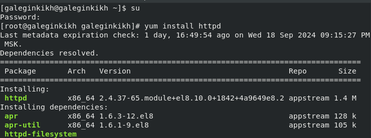{ #fig:001 width=70% }

**2.** В конфигурационном файле /etc/httpd/httpd.conf задала параметр ServerName. Отключила пакетный фильтр. (рис. [-@fig:002])

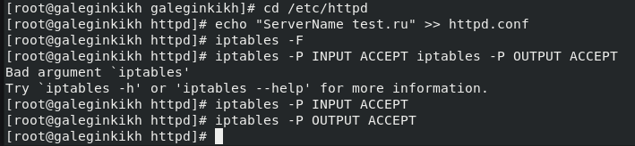{ #fig:002 width=70% }

**3.** Вошла в систему с полученными учётными данными и убедилась, что SELinux работает в режиме enforcing политики targeted. (рис. [-@fig:003])

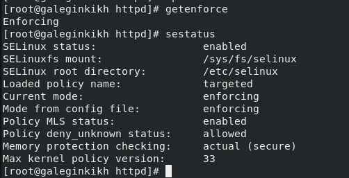{ #fig:003 width=70% }

**4.** Обратитилась с помощью браузера к веб-серверу, запущенному на компьютере, и убедилась, что последний работает. Он не работает, запустила его так же, но с параметром start. (рис. [-@fig:004]) (рис. [-@fig:005])

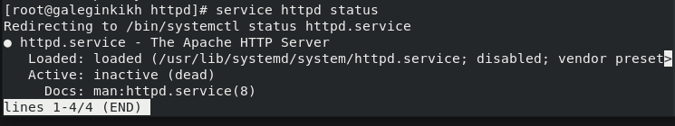{ #fig:004 width=70% }

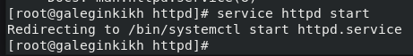{ #fig:005 width=70% }

**5.** Нашла веб-сервер Apache в списке процессов, определила его контекст безопасности. (рис. [-@fig:006])

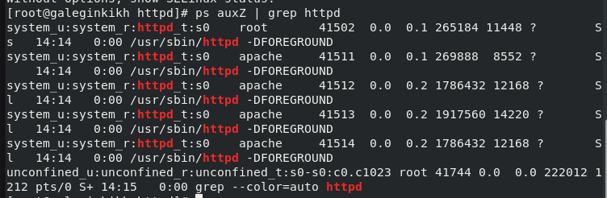{ #fig:006 width=70% }

**6.** Посмотрела текущее состояние переключателей SELinux для Apache. Обратила внимание, что многие из них находятся в положении «off». (рис. [-@fig:007])

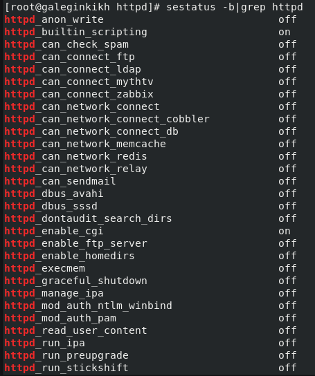{ #fig:007 width=70% } 

**7.** Посмотрела статистику по политике с помощью команды seinfo, также определила множество пользователей, ролей, типов. (рис. [-@fig:008])

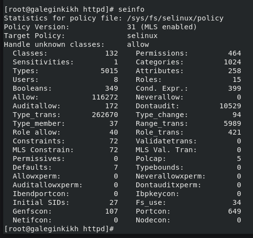{ #fig:008 width=70% } 

**8.**  Определила тип файлов и поддиректорий, находящихся в директории /var/www. (рис. [-@fig:009])

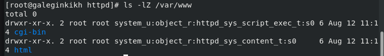{ #fig:009 width=70% } 

**9.** Определила тип файлов, находящихся в директории /var/www/html. (рис. [-@fig:010])

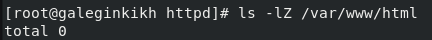{ #fig:010 width=70% }

**10.** Определила круг пользователей, которым разрешено создание файлов в директории /var/www/html. (рис. [-@fig:011])

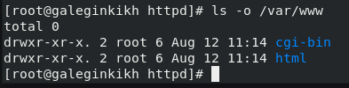{ #fig:011 width=70% }

**11.** Создала от имени суперпользователя html-файл /var/www/html/test.html. (рис. [-@fig:012])

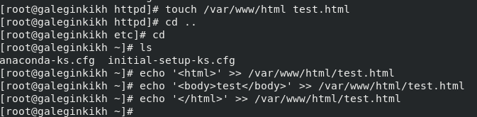{ #fig:012 width=70% }

**12.** Проверила контекст созданного файла. (рис. [-@fig:013])

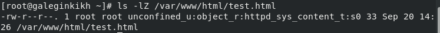{ #fig:013 width=70% }

**13.** Обратитилась к файлу через веб-сервер, введя в браузере адрес http://127.0.0.1/test.html. (рис. [-@fig:014])

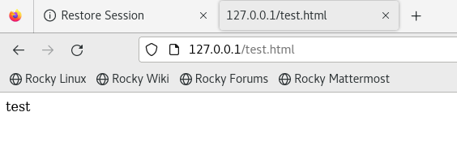{ #fig:014 width=70% }

**14.** Изучила справку man httpd_selinux и выяснила, какие контексты файлов определены для httpd. (рис. [-@fig:015])

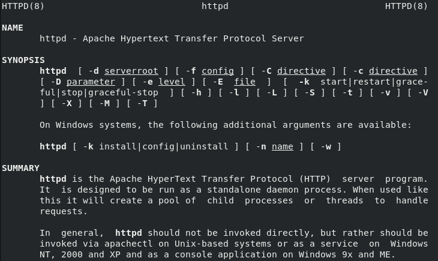{ #fig:015 width=70% }

**15.** Изменила контекст файла /var/www/html/test.html с httpd_sys_content_t на любой другой, к которому процесс httpd не должен иметь доступа. (рис. [-@fig:016])

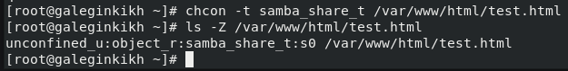{ #fig:016 width=70% }

**16.** Попробовала ещё раз получить доступ к файлу через веб-сервер, введя в браузере адрес http://127.0.0.1/test.html. (рис. [-@fig:017])

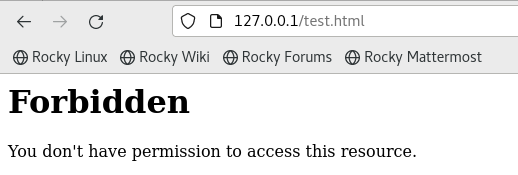{ #fig:017 width=70% }

**17.** Проанализировала ситуацию. Также просмотрела лог-файл. (рис. [-@fig:018]) (рис. [-@fig:019])

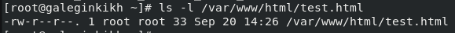{ #fig:018 width=70% }

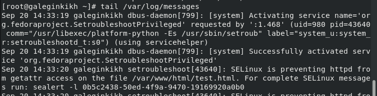{ #fig:019 width=70% }

**18.** Нашла строчку Listen 80 и заменила её на Listen 81. (рис. [-@fig:020])

{ #fig:020 width=70% }

**19.** Проанализировала лог-файлы. (рис. [-@fig:021])

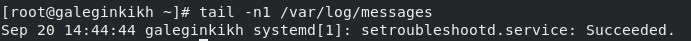{ #fig:021 width=70% }

**20.** Проверила список портов командой. Убедитесь, что порт 81 появился в списке. (рис. [-@fig:022])

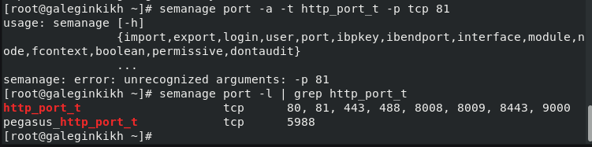{ #fig:022 width=70% }

**21.** Попробовала запустить веб-сервер Apache ещё раз. (рис. [-@fig:023])

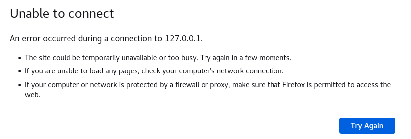{ #fig:023 width=70% }

**22.** Вернула контекст httpd_sys_cоntent__t к файлу /var/www/html/ test.html. После этого попробовала получить доступ к файлу через веб-сервер, введя в браузере адрес http://127.0.0.1:81/test.html. (рис. [-@fig:024]) (рис. [-@fig:025])

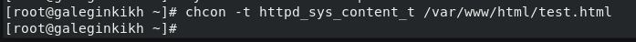{ #fig:024 width=70% }

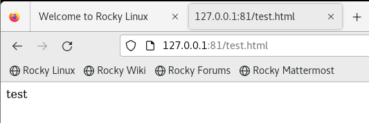{ #fig:025 width=70% }

**23.** Исправила обратно конфигурационный файл apache, вернув Listen 80. 

**24.** Удалила привязку http_port_t к 81 порту и проверьте, что порт 81 удалён. (рис. [-@fig:026])

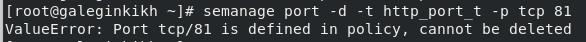{ #fig:026 width=70% }

24. Удалила файл /var/www/html/test.html. (рис. [-@fig:027])

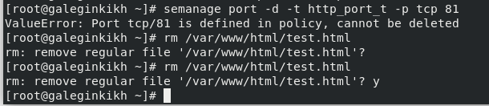{ #fig:027 width=70% }

# Вывод

Развила навыки администрирования ОС Linux. Получила первое практическое знакомство с технологией SELinux. Проверила работу SELinx на практике совместно с веб-сервером Apache.

