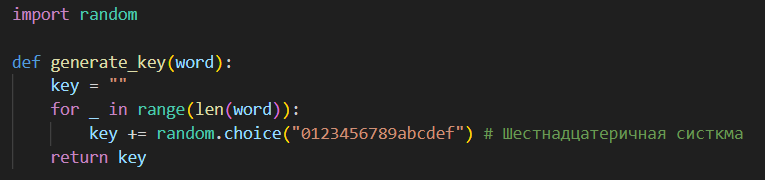
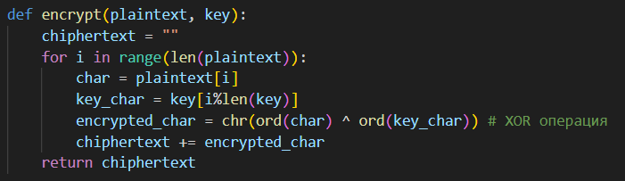
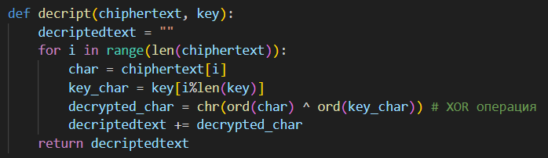
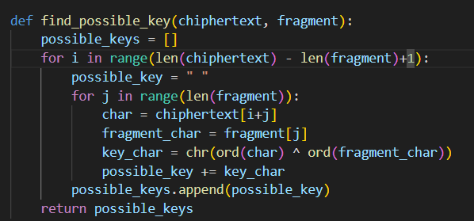
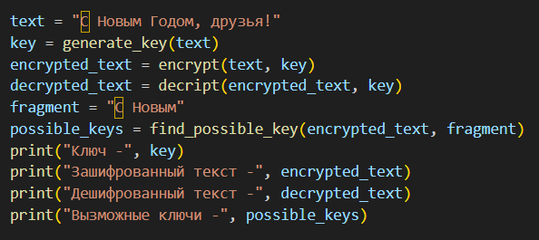
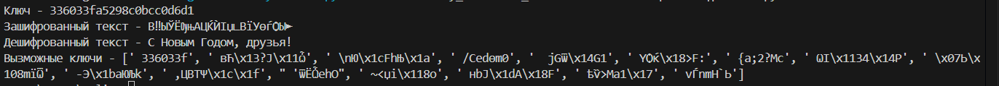

---
## Front matter
title: "Отчет по лабораторной работе №7"
subtitle: "Элементы криптографии. Однократное гаммирование"
author: "Легиньких Галина Андреевна"

## Generic otions
lang: ru-RU
toc-title: "Содержание"
## Pdf output format
toc: true # Table of contents
toc-depth: 2
lof: true # List of figures
lot: true # List of tables
fontsize: 12pt
linestretch: 1.5
papersize: a4
documentclass: scrreprt
## I18n polyglossia
polyglossia-lang:
  name: russian
  options:
  - spelling=modern
  - babelshorthands=true
polyglossia-otherlangs:
  name: english
## I18n babel
babel-lang: russian
babel-otherlangs: english
## Fonts
mainfont: PT Serif
romanfont: PT Serif
sansfont: PT Sans
monofont: PT Mono
mainfontoptions: Ligatures=TeX
romanfontoptions: Ligatures=TeX
sansfontoptions: Ligatures=TeX,Scale=MatchLowercase
monofontoptions: Scale=MatchLowercase,Scale=0.9
## Biblatex
biblatex: true
biblio-style: "gost-numeric"
biblatexoptions:
  - parentracker=true
  - backend=biber
  - hyperref=auto
  - language=auto
  - autolang=other*
  - citestyle=gost-numeric
## Pandoc-crossref LaTeX customization
figureTitle: "Рис."
tableTitle: "Таблица"
listingTitle: "Листинг"
lofTitle: "Список иллюстраций"
lotTitle: "Список таблиц"
lolTitle: "Листинги"
## Misc options
indent: true
header-includes:
  - \usepackage{indentfirst}
  - \usepackage{float} # keep figures where there are in the text
  - \floatplacement{figure}{H} # keep figures where there are in the text
---

# Цель работы

Освоить на практике применение режима однократного гаммирования.

# Выполнение лабораторной работы

**1.** Написала функцию для генерации рандомного ключа(состоит из случайно последовательности символов. (рис. [-@fig:001])

{ #fig:001 width=70% }

**2.** Функция шифрования. В основе используется XOR. (рис. [-@fig:002])

{ #fig:002 width=70% }

**3.** Аналогичный принцип для дешифрования. (рис. [-@fig:003])

{ #fig:003 width=70% }

**4.** Функция нахождения ключей для фрагмента. (рис. [-@fig:004])

{ #fig:004 width=70% }

**5.** Основной кусок кода, где задается строчка и вызов всех функций. (рис. [-@fig:005])

{ #fig:005 width=70% }

**6.** После запуска программы мы получим следующее. (рис. [-@fig:006])

{ #fig:006 width=70% }

# Вывод

Освоила на практике применение режима однократного гаммирования.