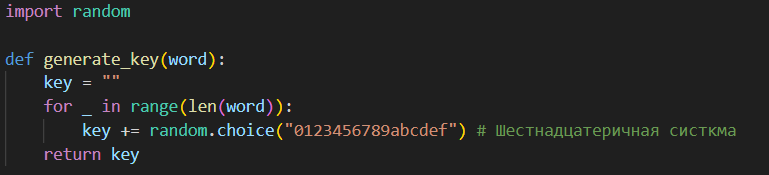
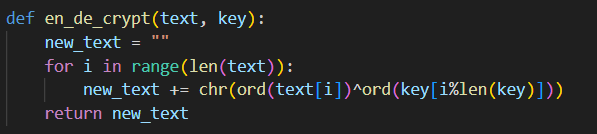
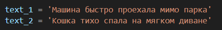
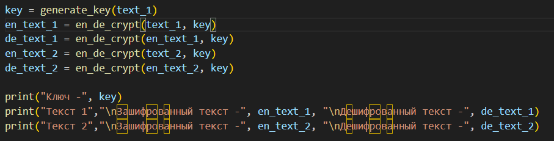
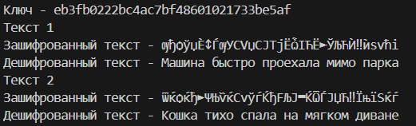

---
## Front matter
lang: ru-RU
title: Лабораторная работа №8
subtitle: Элементы криптографии. Шифрование (кодирование) различных исходных текстов одним ключом
author:
  - Легиньких Г.А.
institute:
  - Российский университет дружбы народов, Москва, Россия

## i18n babel
babel-lang: russian
babel-otherlangs: english

## Formatting pdf
toc: false
toc-title: Содержание
slide_level: 2
aspectratio: 169
section-titles: true
theme: metropolis
header-includes:
 - \metroset{progressbar=frametitle,sectionpage=progressbar,numbering=fraction}
 - '\makeatletter'
 - '\beamer@ignorenonframefalse'
 - '\makeatother'
---

# Информация

## Докладчик

:::::::::::::: {.columns align=center}
::: {.column width="70%"}

  * Легиньких Галина Андреевна
  * НФИбд-02-21
  * Российский университет дружбы народов
  * [1032216447@pfur.ru](mailto:1032216447@pfur.ru)
  * <https://github.com/galeginkikh>

:::
::: {.column width="30%"}

:::
::::::::::::::

# Выполнение

## Цель работы

Освоить на практике применение режима однократного гаммирования на примере кодирования различных исходных текстов одним ключом.

## Выполнение лабораторной работы

**1.** Написала функцию для генерации рандомного ключа(состоит из случайно последовательности символов). 

{ #fig:001 width=70% }

## Выполнение лабораторной работы

**2.** Добавила функцию для шифрования и дешифрования. 

{ #fig:002 width=70% }

## Выполнение лабораторной работы

**3.** Задала два предложения одной длины. 

{ #fig:003 width=70% }

## Выполнение лабораторной работы

**4.** Использовала один ключ для шифрования и дешифрования обоих предложений. 

{ #fig:004 width=70% }

## Выполнение лабораторной работы

**5.** После запуска получилось вот это. 

{ #fig:005 width=70% }

# Вывод

Освоила на практике применение режима однократного гаммирования на примере кодирования различных исходных текстов одним ключом.