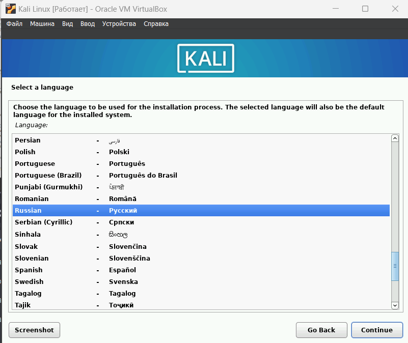

---
## Front matter
lang: ru-RU
title: Проект
subtitle: Этап 1
author:
  - Легиньких Г.А.
institute:
  - Российский университет дружбы народов, Москва, Россия

## i18n babel
babel-lang: russian
babel-otherlangs: english

## Formatting pdf
toc: false
toc-title: Содержание
slide_level: 2
aspectratio: 169
section-titles: true
theme: metropolis
header-includes:
 - \metroset{progressbar=frametitle,sectionpage=progressbar,numbering=fraction}
 - '\makeatletter'
 - '\beamer@ignorenonframefalse'
 - '\makeatother'
---

# Информация

## Докладчик

:::::::::::::: {.columns align=center}
::: {.column width="70%"}

  * Легиньких Галина Андреевна
  * НФИбд-02-21
  * Российский университет дружбы народов
  * [1032216447@pfur.ru](mailto:1032216447@pfur.ru)
  * <https://github.com/galeginkikh>

:::
::: {.column width="30%"}

:::
::::::::::::::

# Выполнение

## Цель работы
Знакомство с дистрибутивом Kali Linux.

## Выполнение лабораторной работы

**1.** Скачала сайт Kali Linux образ.

**2.** Настроила виртуальную машину. (рис. [-@fig:002], [-@fig:003], [-@fig:004],[-@fig:005])

##

{ #fig:002 width=70% }

##

{ #fig:003 width=70% }

##

{ #fig:004 width=70% }

##

{ #fig:005 width=70% }

##

**3.** Задала учетные данные. (рис. [-@fig:006])

{ #fig:006 width=70% }

##

**4.** Перезапустила и зашла под учеткой. (рис. [-@fig:007])

{ #fig:007 width=70% }

# Вывод

Я познакомилась дистрибутивом Kali Linux.