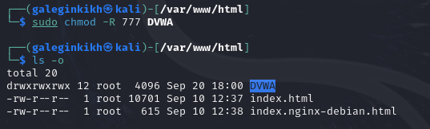

---
## Front matter
lang: ru-RU
title: Проект
subtitle: Этап 2
author:
  - Легиньких Г.А.
institute:
  - Российский университет дружбы народов, Москва, Россия

## i18n babel
babel-lang: russian
babel-otherlangs: english

## Formatting pdf
toc: false
toc-title: Содержание
slide_level: 2
aspectratio: 169
section-titles: true
theme: metropolis
header-includes:
 - \metroset{progressbar=frametitle,sectionpage=progressbar,numbering=fraction}
 - '\makeatletter'
 - '\beamer@ignorenonframefalse'
 - '\makeatother'
---

# Информация

## Докладчик

:::::::::::::: {.columns align=center}
::: {.column width="70%"}

  * Легиньких Галина Андреевна
  * НФИбд-02-21
  * Российский университет дружбы народов
  * [1032216447@pfur.ru](mailto:1032216447@pfur.ru)
  * <https://github.com/galeginkikh>

:::
::: {.column width="30%"}

:::
::::::::::::::

# Выполнение

## Цель работы

Преобретение практических навыков по установке DVWA.

## Выполнение этапа 2

**1.** Перешла в директорию /var/www/html. Затем клонировала репозиторий.

{ #fig:001 width=60% }

## Выполнение этапа 2

**2.** Проверяю, что файл склонировался. Повышаю права доступа к папке до 777. 

{ #fig:002 width=60% }

## Выполнение этапа 2

{ #fig:003 width=60% }

## Выполнение этапа 2

**3.** Перешла в каталог /dvwa/config. Создала копию файла. 

{ #fig:004 width=60% }

## Выполнение этапа 2

**4.** Открыла файл в тектовом редакторе. 

{ #fig:005 width=60% }

## Выполнение этапа 2

**5.** Изменила данные об имени пользователя и пароле. 

{ #fig:006 width=30% }

## Выполнение этапа 2

**6.** Запустила mysql. 

{ #fig:007 width=60% }

## Выполнение этапа 2

**7.** Авторизовалась в базе от имени пользователя root. Создала нового пользователя. 

{ #fig:008 width=60% }

## Выполнение этапа 2

**8.** Перешла в директорию \apache2. 

{ #fig:009 width=60% } 

## Выполнение этапа 2

**9.** В файле php.ini изменила один параметр. 

{ #fig:010 width=60% }

## Выполнение этапа 2

**10.** Запустила службу веб-сервера apache. 

{ #fig:012 width=60% }

## Выполнение этапа 2

**11.** Зашла в веб-сервер. 

{ #fig:013 width=60% }

## Выполнение этапа 2

**12.** Авторизовалась. 

{ #fig:014 width=60% }

# Вывод

Преобрела практические навыки по установке DVWA.