---
## Front matter
title: "Отчет по проекту"
subtitle: "Этап 2"
author: "Легиньких Галина Андреевна"

## Generic otions
lang: ru-RU
toc-title: "Содержание"
## Pdf output format
toc: true # Table of contents
toc-depth: 2
lof: true # List of figures
lot: true # List of tables
fontsize: 12pt
linestretch: 1.5
papersize: a4
documentclass: scrreprt
## I18n polyglossia
polyglossia-lang:
  name: russian
  options:
  - spelling=modern
  - babelshorthands=true
polyglossia-otherlangs:
  name: english
## I18n babel
babel-lang: russian
babel-otherlangs: english
## Fonts
mainfont: PT Serif
romanfont: PT Serif
sansfont: PT Sans
monofont: PT Mono
mainfontoptions: Ligatures=TeX
romanfontoptions: Ligatures=TeX
sansfontoptions: Ligatures=TeX,Scale=MatchLowercase
monofontoptions: Scale=MatchLowercase,Scale=0.9
## Biblatex
biblatex: true
biblio-style: "gost-numeric"
biblatexoptions:
  - parentracker=true
  - backend=biber
  - hyperref=auto
  - language=auto
  - autolang=other*
  - citestyle=gost-numeric
## Pandoc-crossref LaTeX customization
figureTitle: "Рис."
tableTitle: "Таблица"
listingTitle: "Листинг"
lofTitle: "Список иллюстраций"
lotTitle: "Список таблиц"
lolTitle: "Листинги"
## Misc options
indent: true
header-includes:
  - \usepackage{indentfirst}
  - \usepackage{float} # keep figures where there are in the text
  - \floatplacement{figure}{H} # keep figures where there are in the text
---

# Цель работы

Преобретение практических навыков по установке DVWA.

# Выполнение этапа 2

**1.** Перешла в директорию /var/www/html. Затем клонировала репозиторий. (рис. [-@fig:001])

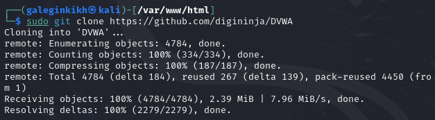{ #fig:001 width=60% }

**2.** Проверяю, что файл склонировался. Повышаю права доступа к папке до 777. (рис. [-@fig:002]) (рис. [-@fig:003])

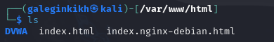{ #fig:002 width=60% }

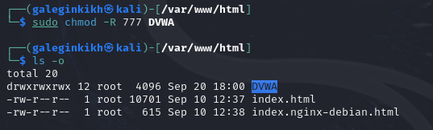{ #fig:003 width=60% }

**3.** Перешла в каталог /dvwa/config. Создала копию файла. (рис. [-@fig:004]) 

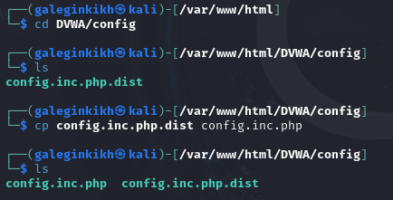{ #fig:004 width=60% }

**4.** Открыла файл в тектовом редакторе. (рис. [-@fig:005])

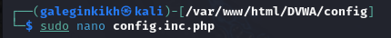{ #fig:005 width=60% }

**5.** Изменила данные об имени пользователя и пароле. (рис. [-@fig:006])

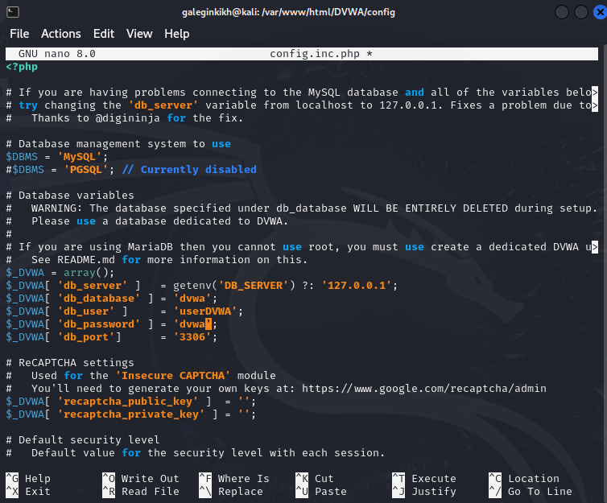{ #fig:006 width=60% }

**6.** Запустила mysql. (рис. [-@fig:007])

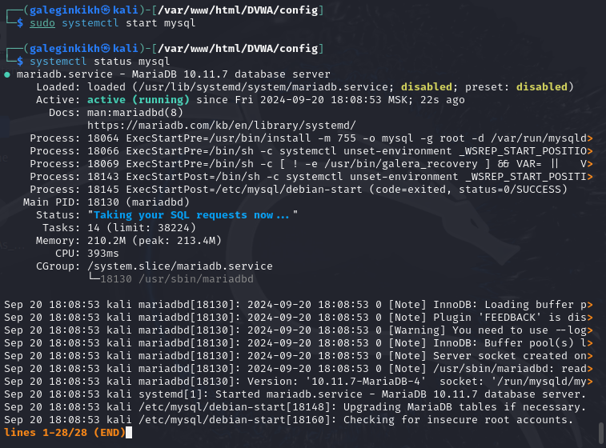{ #fig:007 width=60% }

**7.** Авторизовалась в базе от имени пользователя root. Создала нового пользователя. (рис. [-@fig:008])

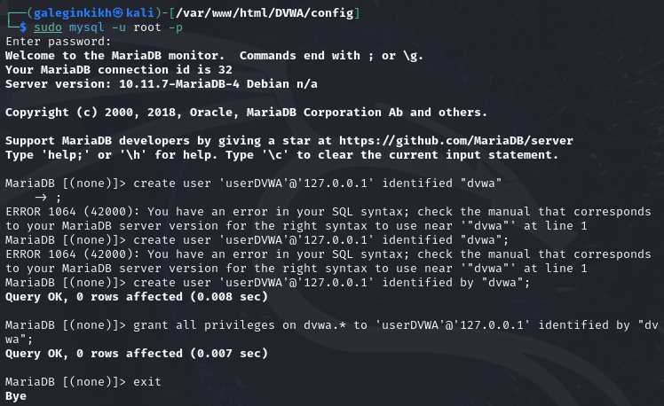{ #fig:008 width=60% }

**8.** Перешла в директорию. (рис. [-@fig:009])

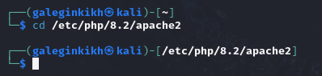{ #fig:009 width=60% } 

**9.** В файле php.ini изменила один параметр. (рис. [-@fig:010])

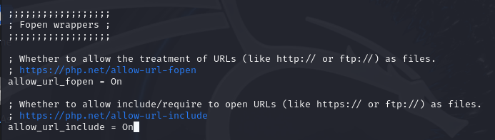{ #fig:010 width=60% }

**10.** Запустила службу веб-сервера apache. (рис. [-@fig:012])

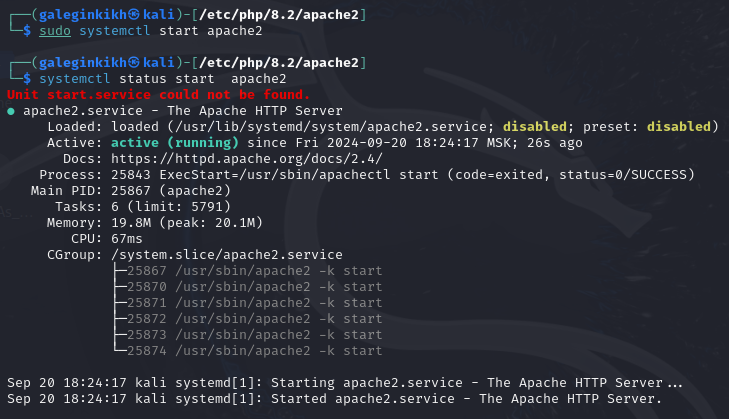{ #fig:012 width=60% }

**11.** Зашла в веб-сервер. (рис. [-@fig:013])

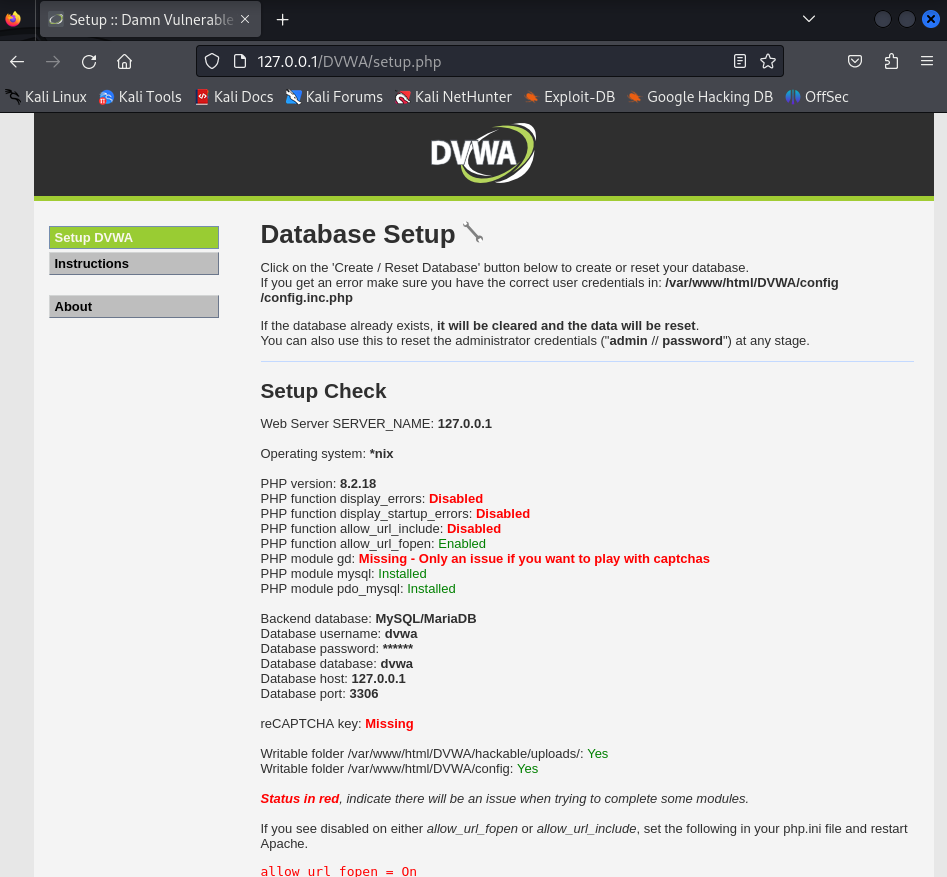{ #fig:013 width=60% }

**12.** Авторизовалась. (рис. [-@fig:014])

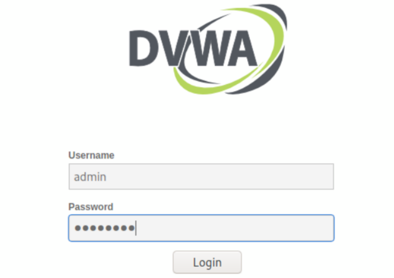{ #fig:014 width=60% }

# Вывод

Преобрела практические навыки по установке DVWA.
