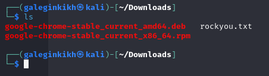
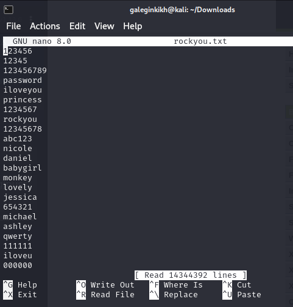
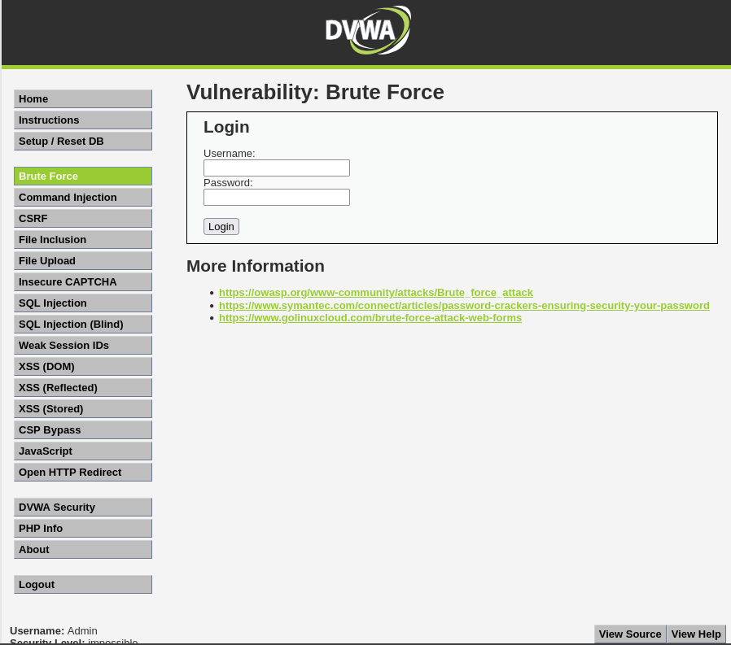
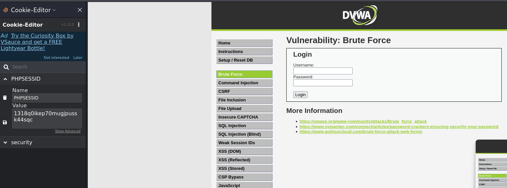
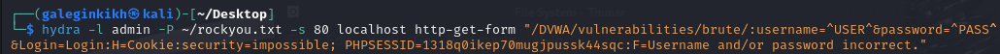
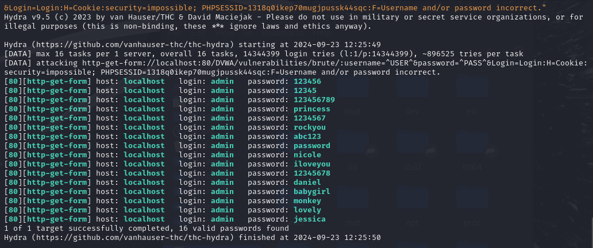
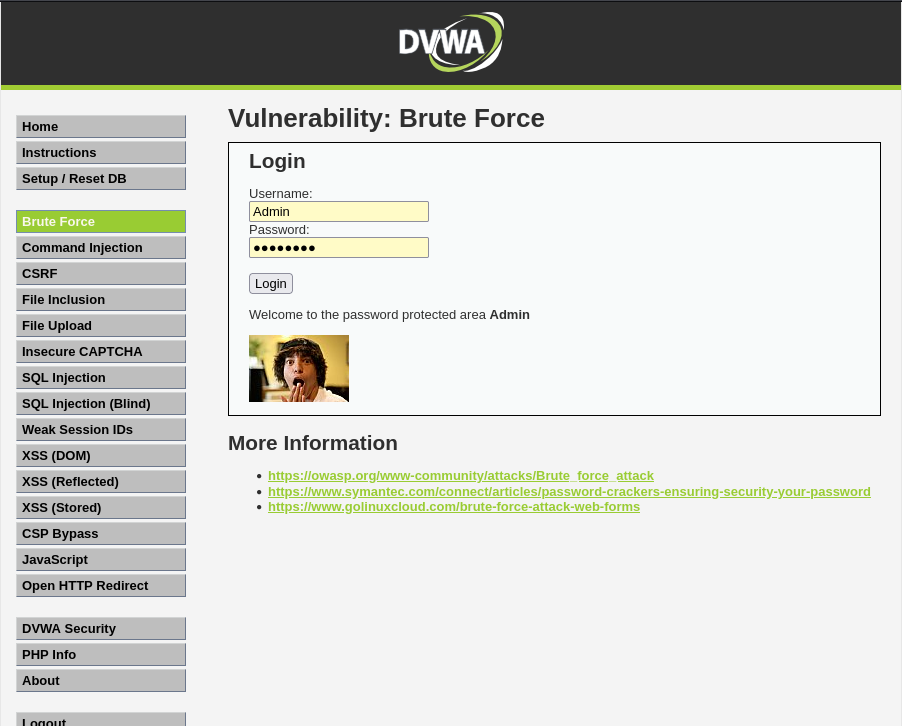

---
## Front matter
lang: ru-RU
title: Проект
subtitle: Этап 3
author:
  - Легиньких Г.А.
institute:
  - Российский университет дружбы народов, Москва, Россия

## i18n babel
babel-lang: russian
babel-otherlangs: english

## Formatting pdf
toc: false
toc-title: Содержание
slide_level: 2
aspectratio: 169
section-titles: true
theme: metropolis
header-includes:
 - \metroset{progressbar=frametitle,sectionpage=progressbar,numbering=fraction}
 - '\makeatletter'
 - '\beamer@ignorenonframefalse'
 - '\makeatother'
---

# Информация

## Докладчик

:::::::::::::: {.columns align=center}
::: {.column width="70%"}

  * Легиньких Галина Андреевна
  * НФИбд-02-21
  * Российский университет дружбы народов
  * [1032216447@pfur.ru](mailto:1032216447@pfur.ru)
  * <https://github.com/galeginkikh>

:::
::: {.column width="30%"}

:::
::::::::::::::

# Выполнение

## Цель работы

Использование Hydra.

## Выполнение этапа 3

**1.**  Нашла и скачала список частоиспользуемых паролей из интернета. rockyou.txt 

{ #fig:001 width=40% }

## Выполнение этапа 3

{ #fig:002 width=20% }

## Выполнение этапа 3

**2.** Захожу на сайт DVWA, созданный на прошлом этапе.

{ #fig:003 width=20% }

## Выполнение этапа 3

**3.** Для запроса hydra мне понадобятся параметры cookie с этого сайта. я скачала расширение для браузера. 

{ #fig:004 width=20% }

## Выполнение этапа 3

**4.** Ввела в hydra запрос с нужную информацию. 

{ #fig:005 width=20% }

## Выполнение этапа 3

**5.** В итоге выводится результат с подходящими паролями. 

{ #fig:006 width=20% }

## Выполнение этапа 3

**6.** Ввела полученные данные на сайт для проверки. Получила положительный результат. 

{ #fig:007 width=20% }

# Вывод

Научилась работать с hydra.
