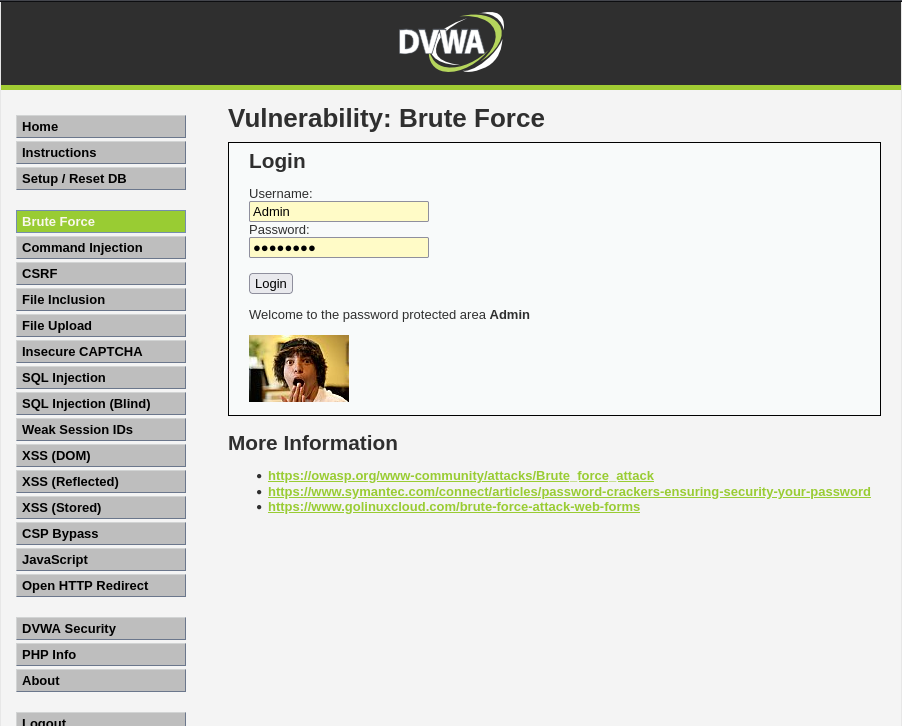

---
## Front matter
title: "Отчет по проекту"
subtitle: "Этап 3"
author: "Легиньких Галина Андреевна"

## Generic otions
lang: ru-RU
toc-title: "Содержание"
## Pdf output format
toc: true # Table of contents
toc-depth: 2
lof: true # List of figures
lot: true # List of tables
fontsize: 12pt
linestretch: 1.5
papersize: a4
documentclass: scrreprt
## I18n polyglossia
polyglossia-lang:
  name: russian
  options:
  - spelling=modern
  - babelshorthands=true
polyglossia-otherlangs:
  name: english
## I18n babel
babel-lang: russian
babel-otherlangs: english
## Fonts
mainfont: PT Serif
romanfont: PT Serif
sansfont: PT Sans
monofont: PT Mono
mainfontoptions: Ligatures=TeX
romanfontoptions: Ligatures=TeX
sansfontoptions: Ligatures=TeX,Scale=MatchLowercase
monofontoptions: Scale=MatchLowercase,Scale=0.9
## Biblatex
biblatex: true
biblio-style: "gost-numeric"
biblatexoptions:
  - parentracker=true
  - backend=biber
  - hyperref=auto
  - language=auto
  - autolang=other*
  - citestyle=gost-numeric
## Pandoc-crossref LaTeX customization
figureTitle: "Рис."
tableTitle: "Таблица"
listingTitle: "Листинг"
lofTitle: "Список иллюстраций"
lotTitle: "Список таблиц"
lolTitle: "Листинги"
## Misc options
indent: true
header-includes:
  - \usepackage{indentfirst}
  - \usepackage{float} # keep figures where there are in the text
  - \floatplacement{figure}{H} # keep figures where there are in the text
---

# Теоретическое введение

Пример работы:
* Исходные данные:
* IP сервера 178.72.90.181;
* Сервис http на стандартном 80 порту;
* Для авторизации используется html форма, которая отправляет по адресу http://178.72.90.181/cgi-bin/luci методом POST запрос вида username=root&password=test_password;
* В случае не удачной аутентификации пользователь наблюдает сообщение Invalid username and/or password! Please try again.
* Запрос к Hydra будет выглядеть примерно так:

      hydra -l root -P ~/pass_lists/dedik_passes.txt -o ./hydra_result.log -f -V -s 80 178.72.90.181 http-post-form "/cgi-bin/luci:username=^USER^&password=^PASS^:Invalid username"

* Используется http-post-form потому, что авторизация происходит по http методом post.
* После указания этого модуля идёт строка /cgi-bin/luci:username=^USER^&password=^PASS^:Invalid username, у которой через двоеточие (:) указывается:
* путь до скрипта, который обрабатывает процесс аутентификации (/cgi-bin/luci);
* строка, которая передаётся методом POST, в которой логин и пароль заменены на ^USER^ и ^PASS^ соответственно (username=^USER^&password=^PASS^);
* строка, которая присутствует на странице при неудачной аутентификации; при её отсутствии Hydra поймёт, что мы успешно вошли (Invalid username).

# Цель работы

Использование Hydra.

# Выполнение этапа 3

**1.**  Нашла и скачала список частоиспользуемых паролей из интернета. rockyou.txt (рис. [-@fig:001]) (рис. [-@fig:002])

{ #fig:001 width=60% }

{ #fig:002 width=60% }

**2.** Захожу на сайт DVWA, созданный на прошлом этапе. (рис. [-@fig:003])

{ #fig:003 width=60% }

**3.** Для запроса hydra мне понадобятся параметры cookie с этого сайта. я скачала расширение для браузера. (рис. [-@fig:004])

{ #fig:004 width=60% }

**4.** Ввела в hydra запрос с нужную информацию. (рис. [-@fig:005])

{ #fig:005 width=60% }

**5.** В итоге выводится результат с подходящими паролями. (рис. [-@fig:006])

{ #fig:006 width=60% }

**6.** Ввела полученные данные на сайт для проверки. Получила положительный результат. (рис. [-@fig:007])

{ #fig:007 width=60% }

# Вывод

Научилась работать с hydra.
