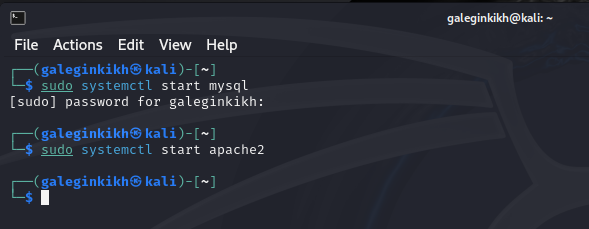
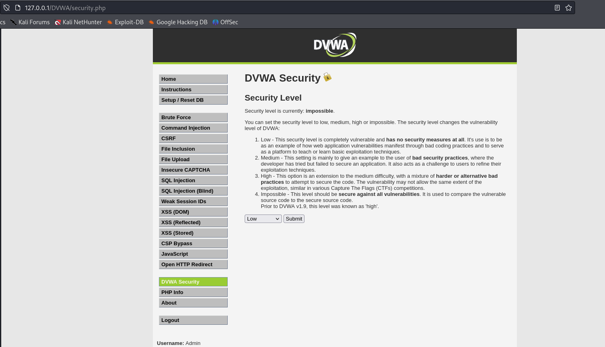
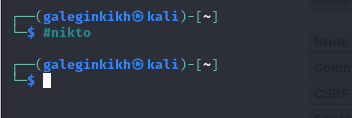
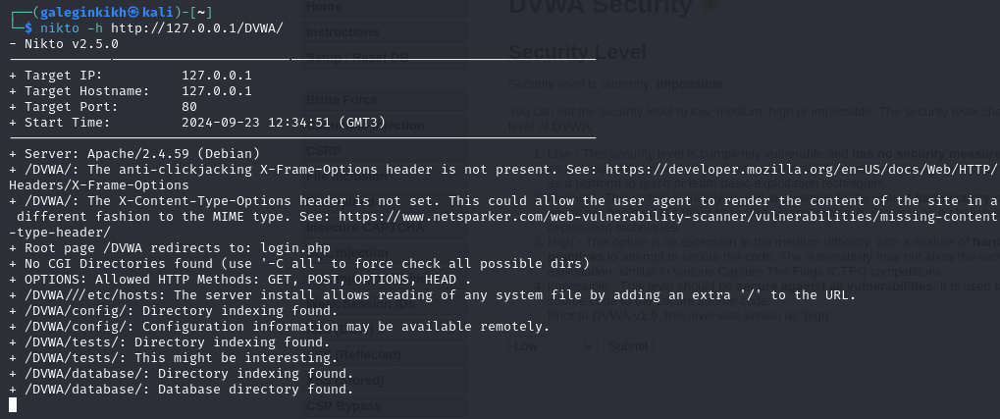
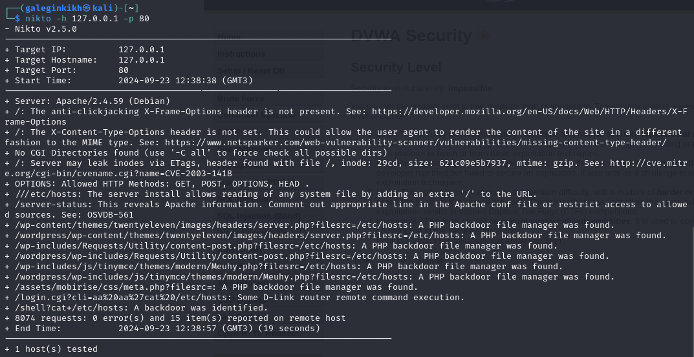

---
## Front matter
lang: ru-RU
title: Проект
subtitle: Этап 4
author:
  - Легиньких Г.А.
institute:
  - Российский университет дружбы народов, Москва, Россия

## i18n babel
babel-lang: russian
babel-otherlangs: english

## Formatting pdf
toc: false
toc-title: Содержание
slide_level: 2
aspectratio: 169
section-titles: true
theme: metropolis
header-includes:
 - \metroset{progressbar=frametitle,sectionpage=progressbar,numbering=fraction}
 - '\makeatletter'
 - '\beamer@ignorenonframefalse'
 - '\makeatother'
---

# Информация

## Докладчик

:::::::::::::: {.columns align=center}
::: {.column width="70%"}

  * Легиньких Галина Андреевна
  * НФИбд-02-21
  * Российский университет дружбы народов
  * [1032216447@pfur.ru](mailto:1032216447@pfur.ru)
  * <https://github.com/galeginkikh>

:::
::: {.column width="30%"}

:::
::::::::::::::

# Выполнение

## Цель работы

Использование nikto.

## Выполнение этапа 4

**1.** Подготовила веб-приложение. 

{ #fig:001 width=50% }

## Выполнение этапа 4

**2.** Ввела в адресной строке адрес DVWA, перешла в режим выбора уровня безопасности, и поставила минимальный. 

{ #fig:002 width=50% }

## Выполнение этапа 4

**3.** Запустила nikto. 

{ #fig:003 width=50% }

## Выполнение этапа 4

**4.** Проверила веб-приложение, введя его URL и не вводя порт. 

{ #fig:004 width=50% }

## Выполнение этапа 4

**5.** Теперь попробовала просканировать введя адрес хоста и адрес порта. Результат немного отличается. 

{ #fig:005 width=50% }

## Анализ результатов сканирования

Кроме адреса хоста и адреса порта веб-приложение выводит информацию о различных уязвимостях.

# Вывод

Научилась использовать сканер nikto для тестирования веб-приложений.
