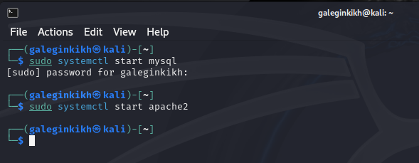
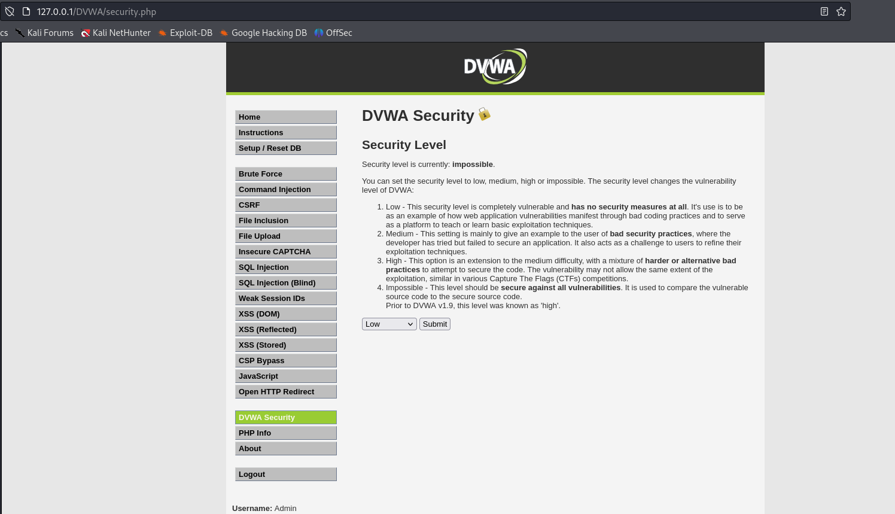
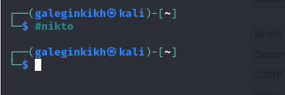
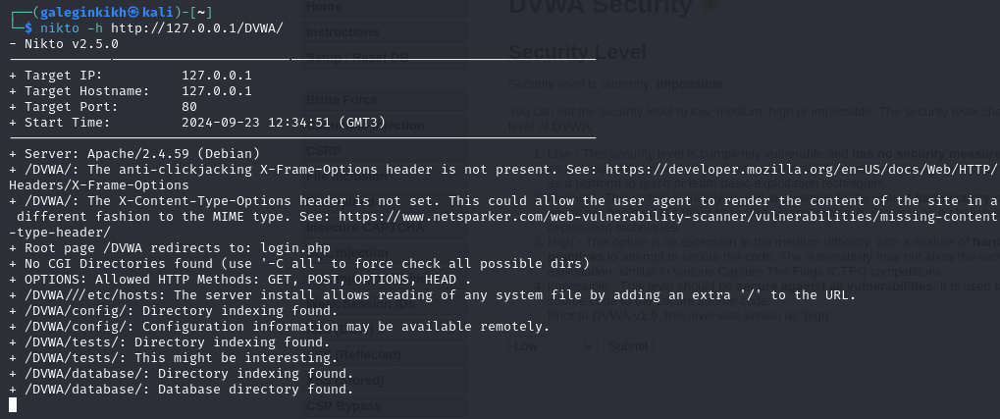
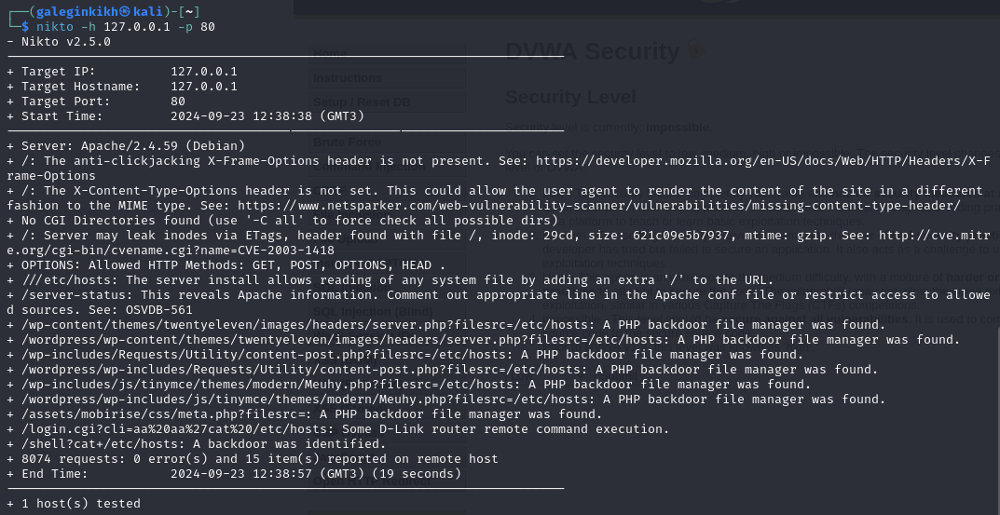

---
## Front matter
title: "Отчет по проекту"
subtitle: "Этап 4"
author: "Легиньких Галина Андреевна"

## Generic otions
lang: ru-RU
toc-title: "Содержание"
## Pdf output format
toc: true # Table of contents
toc-depth: 2
lof: true # List of figures
lot: true # List of tables
fontsize: 12pt
linestretch: 1.5
papersize: a4
documentclass: scrreprt
## I18n polyglossia
polyglossia-lang:
  name: russian
  options:
  - spelling=modern
  - babelshorthands=true
polyglossia-otherlangs:
  name: english
## I18n babel
babel-lang: russian
babel-otherlangs: english
## Fonts
mainfont: PT Serif
romanfont: PT Serif
sansfont: PT Sans
monofont: PT Mono
mainfontoptions: Ligatures=TeX
romanfontoptions: Ligatures=TeX
sansfontoptions: Ligatures=TeX,Scale=MatchLowercase
monofontoptions: Scale=MatchLowercase,Scale=0.9
## Biblatex
biblatex: true
biblio-style: "gost-numeric"
biblatexoptions:
  - parentracker=true
  - backend=biber
  - hyperref=auto
  - language=auto
  - autolang=other*
  - citestyle=gost-numeric
## Pandoc-crossref LaTeX customization
figureTitle: "Рис."
tableTitle: "Таблица"
listingTitle: "Листинг"
lofTitle: "Список иллюстраций"
lotTitle: "Список таблиц"
lolTitle: "Листинги"
## Misc options
indent: true
header-includes:
  - \usepackage{indentfirst}
  - \usepackage{float} # keep figures where there are in the text
  - \floatplacement{figure}{H} # keep figures where there are in the text
---

# Теореетическое введение

**nikto** — базовый сканер безопасности веб-сервера. Он сканирует и обнаруживает уязвимости в веб-приложениях, обычно вызванные неправильной конфигурацией на самом сервере, файлами, установленными по умолчанию, и небезопасными файлами, а также устаревшими серверными приложениями.

# Цель работы

Использование nikto.

# Выполнение этапа 4

**1.** Подготовила веб-приложение. (рис. [-@fig:001])

{ #fig:001 width=60% }

**2.** Ввела в адресной строке адрес DVWA, перешла в режим выбора уровня безопасности, и поставила минимальный. (рис. [-@fig:002])

{ #fig:002 width=60% }

**3.** Запустила nikto. (рис. [-@fig:003])

{ #fig:003 width=60% }

**4.** Проверила веб-приложение, введя его URL и не вводя порт. (рис. [-@fig:004])

{ #fig:004 width=60% }

**5.** Теперь попробовала просканировать введя адрес хоста и адрес порта. Результат немного отличается. (рис. [-@fig:005])

{ #fig:005 width=60% }

# Анализ результатов сканирования

Кроме адреса хоста и адреса порта веб-приложение выводит информацию о различных уязвимостях:

+ Server: Apache/2.4.59 (Debian)
+ /DVWA/: The anti-clickjacking X-Frame-Options header is not present. See: https://developer.mozilla.org/en-US/docs/Web/HTTP/Headers/X-Frame-Options
+ /DVWA/: The X-Content-Type-Options header is not set. This could allow the user agent to render the content of the site in a different fashion to the MIME type. See: https://www.netsparker.com/web-vulnerability-scanner/vulnerabilities/missing-content-type-header/
+ Root page /DVWA redirects to: login.php
+ No CGI Directories found (use '-C all' to force check all possible dirs)
+ OPTIONS: Allowed HTTP Methods: GET, POST, OPTIONS, HEAD .
+ /DVWA///etc/hosts: The server install allows reading of any system file by adding an extra '/' to the URL.
+ /DVWA/config/: Directory indexing found.
+ /DVWA/config/: Configuration information may be available remotely.
+ /DVWA/tests/: Directory indexing found.
+ /DVWA/tests/: This might be interesting.
+ /DVWA/database/: Directory indexing found.
+ /DVWA/database/: Database directory found.
+ /DVWA/docs/: Directory indexing found.
+ /DVWA/login.php: Admin login page/section found.
+ /DVWA/.git/index: Git Index file may contain directory listing information.
+ /DVWA/.git/HEAD: Git HEAD file found. Full repo details may be present.
+ /DVWA/.git/config: Git config file found. Infos about repo details may be present.
+ /DVWA/.gitignore: .gitignore file found. It is possible to grasp the directory structure.
+ /DVWA/wp-content/themes/twentyeleven/images/headers/server.php?filesrc=/etc/hosts: A PHP backdoor file manager was found.
+ /DVWA/wordpress/wp-content/themes/twentyeleven/images/headers/server.php?filesrc=/etc/hosts: A PHP backdoor file manager was found.
+ /DVWA/wp-includes/Requests/Utility/content-post.php?filesrc=/etc/hosts: A PHP backdoor file manager was found.
+ /DVWA/wordpress/wp-includes/Requests/Utility/content-post.php?filesrc=/etc/hosts: A PHP backdoor file manager was found.
+ /DVWA/wp-includes/js/tinymce/themes/modern/Meuhy.php?filesrc=/etc/hosts: A PHP backdoor file manager was found.
+ /DVWA/wordpress/wp-includes/js/tinymce/themes/modern/Meuhy.php?filesrc=/etc/hosts: A PHP backdoor file manager was found.
+ /DVWA/assets/mobirise/css/meta.php?filesrc=: A PHP backdoor file manager was found.
+ /DVWA/login.cgi?cli=aa%20aa%27cat%20/etc/hosts: Some D-Link router remote command execution.
+ /DVWA/shell?cat+/etc/hosts: A backdoor was identified.
+ /DVWA/.dockerignore: .dockerignore file found. It may be possible to grasp the directory structure and learn more about the site.

# Вывод

Научилась использовать сканер nikto для тестирования веб-приложений.