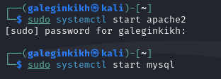
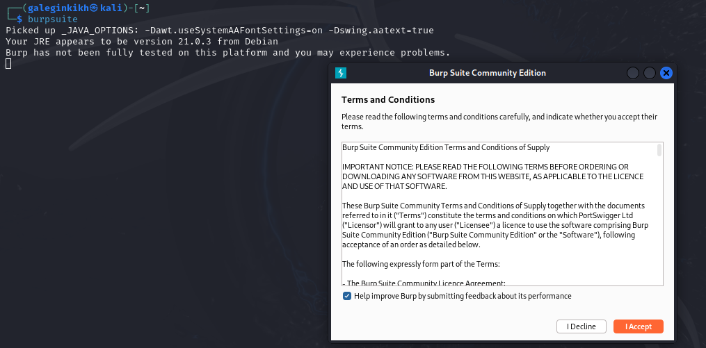
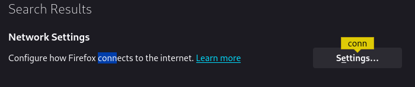
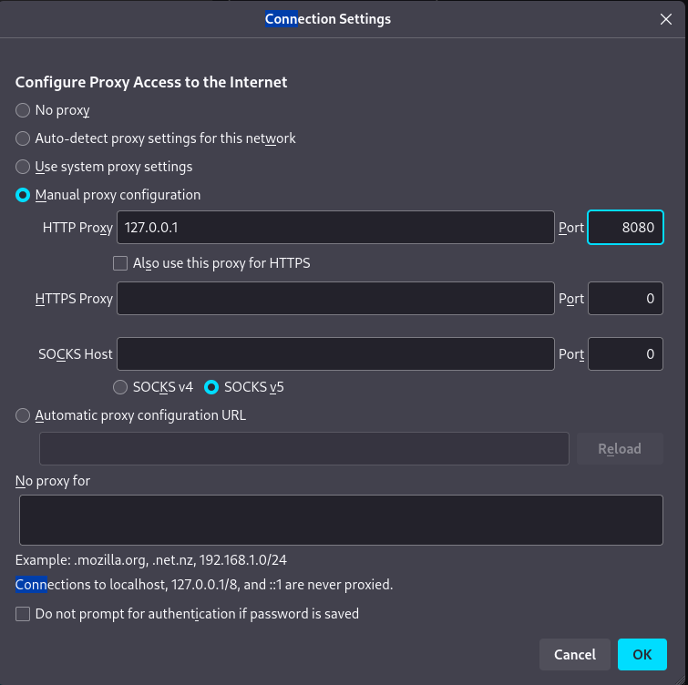
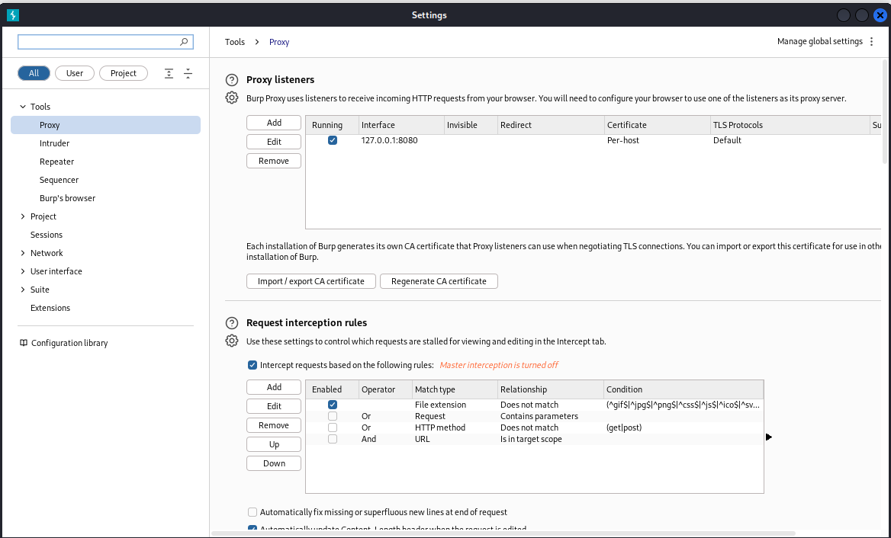
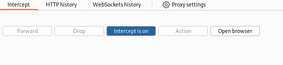
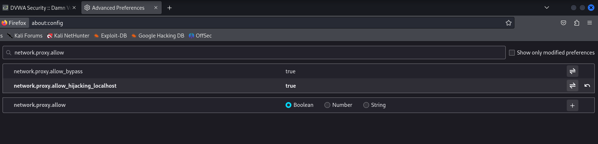
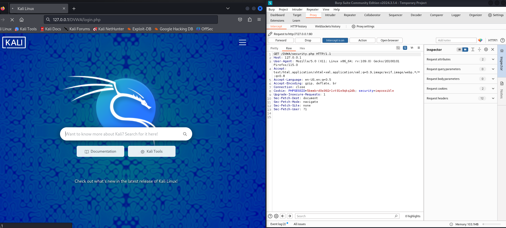
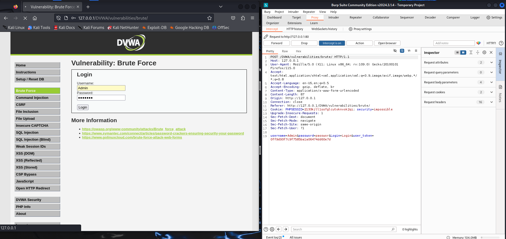
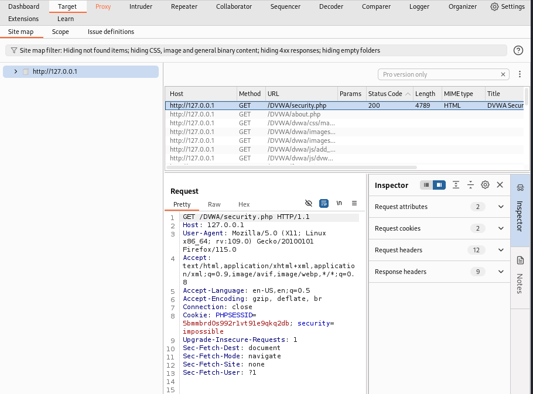

---
## Front matter
lang: ru-RU
title: Проект
subtitle: Этап 5
author:
  - Легиньких Г.А.
institute:
  - Российский университет дружбы народов, Москва, Россия

## i18n babel
babel-lang: russian
babel-otherlangs: english

## Formatting pdf
toc: false
toc-title: Содержание
slide_level: 2
aspectratio: 169
section-titles: true
theme: metropolis
header-includes:
 - \metroset{progressbar=frametitle,sectionpage=progressbar,numbering=fraction}
 - '\makeatletter'
 - '\beamer@ignorenonframefalse'
 - '\makeatother'
---

# Информация

## Докладчик

:::::::::::::: {.columns align=center}
::: {.column width="70%"}

  * Легиньких Галина Андреевна
  * НФИбд-02-21
  * Российский университет дружбы народов
  * [1032216447@pfur.ru](mailto:1032216447@pfur.ru)
  * <https://github.com/galeginkikh>

:::
::: {.column width="30%"}

:::
::::::::::::::

# Выполнение

## Цель работы

Использование Burp Suite

## Выполнение этапа 5

**1.** Запустила локальный сервер. 

{ #fig:001 width=50% }

## Выполнение этапа 5

**2.** Запустила инструмент Burp Suite. 

{ #fig:002 width=50% }

## Выполнение этапа 5

**3.** Открыла сетевые настройки браузера. 

{ #fig:003 width=50% }

## Выполнение этапа 5

**4.** Изменила настройки сервера для работы с proxy и захватом данных с помощью Burp Suite. 

{ #fig:004 width=50% }

## Выполнение этапа 5

**5.** Изменила настройки proxy инструмента Burp Suite для дальнейшей работы. 

{ #fig:005 width=50% }

## Выполнение этапа 5

**6.** Во вкладке proxy установила "Intercept is on". 

{ #fig:006 width=50% }

## Выполнение этапа 5

**7.** В браузере поменяла еще пару параметров. 

{ #fig:007 width=50% }

## Выполнение этапа 5

**8.** Попыталась зайти в браузере на DVWA, тут же во вкладке proxy появился захваченный запрос. Нажала "Forward", чтобы загрузить страницу. 

{ #fig:008 width=50% }

## Выполнение этапа 5

**9.** Загрузилась страница, и тектс запроса поменялся. 

{ #fig:010 width=50% }

## Выполнение этапа 5

**10.** История запросов хранится во вкладке target. 

{ #fig:009 width=50% }

# Вывод

Научилась использовать инструмент Burp Suite.
