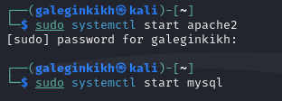
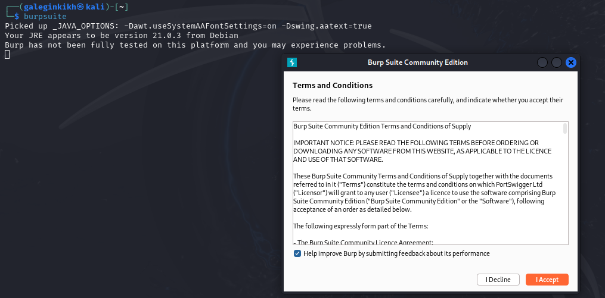
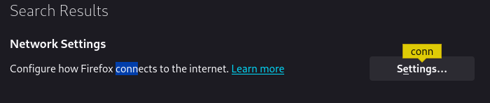
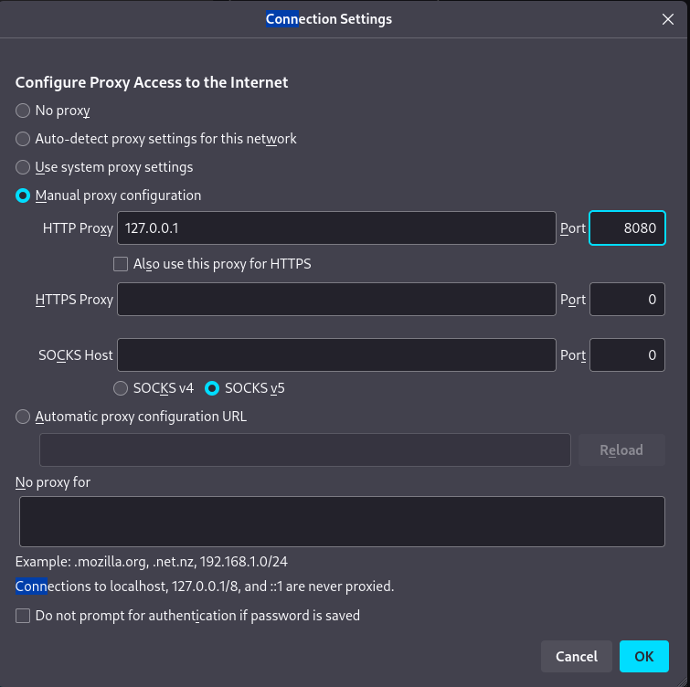
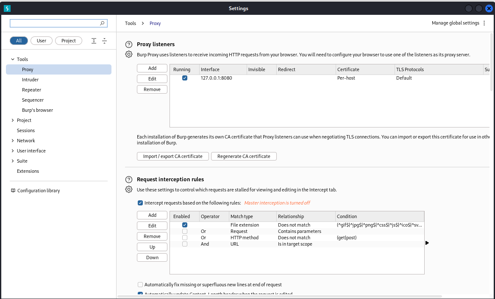
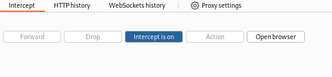
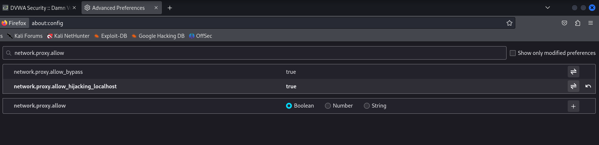
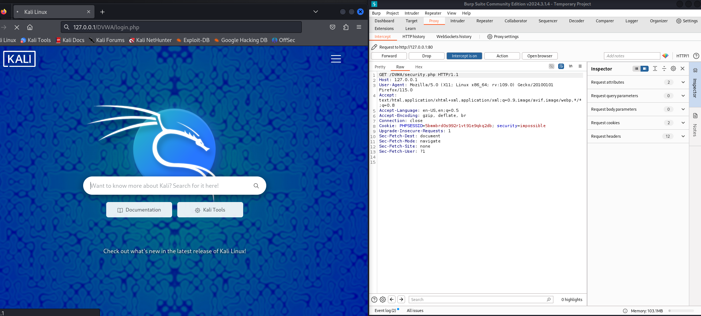
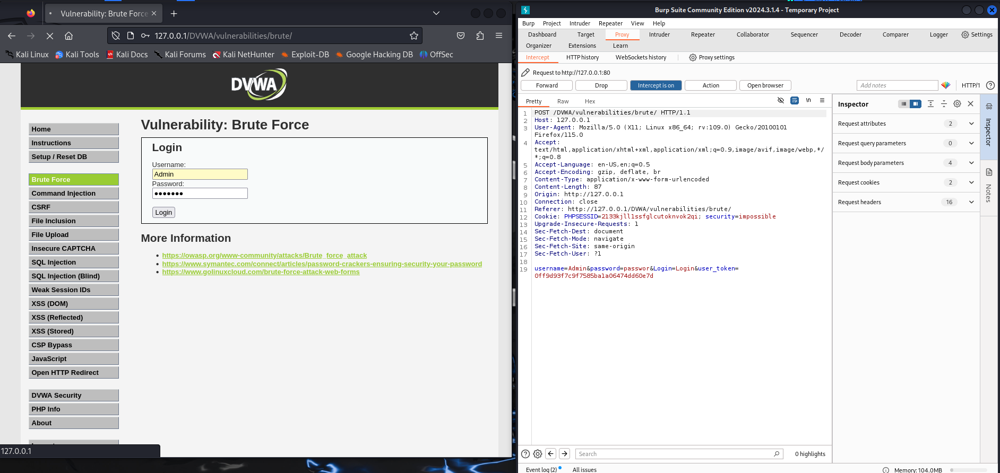
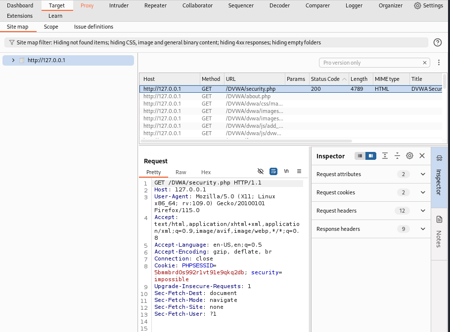

---
## Front matter
title: "Отчет по проекту"
subtitle: "Этап 5"
author: "Легиньких Галина Андреевна"

## Generic otions
lang: ru-RU
toc-title: "Содержание"
## Pdf output format
toc: true # Table of contents
toc-depth: 2
lof: true # List of figures
lot: true # List of tables
fontsize: 12pt
linestretch: 1.5
papersize: a4
documentclass: scrreprt
## I18n polyglossia
polyglossia-lang:
  name: russian
  options:
  - spelling=modern
  - babelshorthands=true
polyglossia-otherlangs:
  name: english
## I18n babel
babel-lang: russian
babel-otherlangs: english
## Fonts
mainfont: PT Serif
romanfont: PT Serif
sansfont: PT Sans
monofont: PT Mono
mainfontoptions: Ligatures=TeX
romanfontoptions: Ligatures=TeX
sansfontoptions: Ligatures=TeX,Scale=MatchLowercase
monofontoptions: Scale=MatchLowercase,Scale=0.9
## Biblatex
biblatex: true
biblio-style: "gost-numeric"
biblatexoptions:
  - parentracker=true
  - backend=biber
  - hyperref=auto
  - language=auto
  - autolang=other*
  - citestyle=gost-numeric
## Pandoc-crossref LaTeX customization
figureTitle: "Рис."
tableTitle: "Таблица"
listingTitle: "Листинг"
lofTitle: "Список иллюстраций"
lotTitle: "Список таблиц"
lolTitle: "Листинги"
## Misc options
indent: true
header-includes:
  - \usepackage{indentfirst}
  - \usepackage{float} # keep figures where there are in the text
  - \floatplacement{figure}{H} # keep figures where there are in the text
---

# Теоретическое введение

**Burp Suite** представляет собой набор мощных инструментов безопасности веб-приложений, которые демонстрируют реальные возможности злоумышленника, проникающего в веб-приложения

# Цель работы

Использование Burp Suite

# Выполнение этапа 5

**1.** Запустила локальный сервер. (рис. [-@fig:001])

{ #fig:001 width=60% }

**2.** Запустила инструмент Burp Suite. (рис. [-@fig:002])

{ #fig:002 width=60% }

**3.** Открыла сетевые настройки браузера. (рис. [-@fig:003])

{ #fig:003 width=60% }

**4.** Изменила настройки сервера для работы с proxy и захватом данных с помощью Burp Suite. (рис. [-@fig:004])

{ #fig:004 width=60% }

**5.** Изменила настройки proxy инструмента Burp Suite для дальнейшей работы. (рис. [-@fig:005])

{ #fig:005 width=60% }

**6.** Во вкладке proxy установила "Intercept is on". (рис. [-@fig:006])

{ #fig:006 width=60% }

**7.** В браузере поменяла еще пару параметров. (рис. [-@fig:007])

{ #fig:007 width=60% }

**8.** Попыталась зайти в браузере на DVWA, тут же во вкладке proxy появился захваченный запрос. Нажала "Forward", чтобы загрузить страницу. (рис. [-@fig:008])

{ #fig:008 width=60% }

**9.** Загрузилась страница, и тектс запроса поменялся. (рис. [-@fig:010])

{ #fig:010 width=60% }

**10.** История запросов хранится во вкладке target. (рис. [-@fig:009])

{ #fig:009 width=60% }

# Вывод

Научилась использовать инструмент Burp Suite.